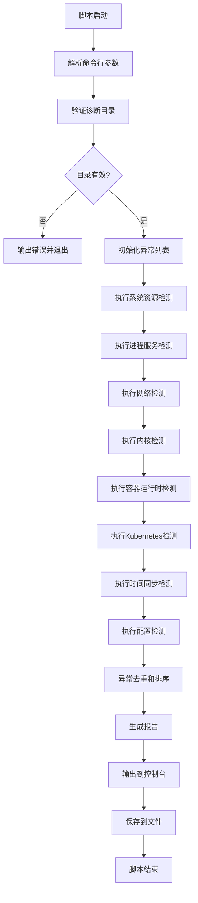

# kudig.sh Shell脚本开发设计文档

## 项目概述

基于现有的 `diagnose_k8s.sh` 诊断脚本收集的日志数据，开发一个名为 `kudig.sh` 的Shell脚本。该脚本将在Kubernetes节点本地运行，逐一分析诊断日志文件，识别异常情况，并输出中文可读的异常描述和对应的英文异常标识符。

## 核心目标

- 本地化分析：脚本在Kubernetes node节点上直接执行，无需外部依赖
- 全面覆盖：分析 `diagnose_k8s.sh` 收集的所有类型日志
- 双语输出：中文异常名称（便于运维人员理解）+ 英文异常标识符（便于工具化处理）
- 智能识别：基于Kubernetes节点常见问题模式进行异常检测

## 输入源分析

### 诊断数据目录结构

基于 `diagnose_k8s.sh` 的收集逻辑，输入数据位于 `/tmp/diagnose_${timestamp}/` 目录，包含以下文件和子目录：

| 文件/目录 | 内容描述 | 分析价值 |
|---------|---------|---------|
| system_info | 操作系统版本、内核版本、ulimit、sysctl参数、vmstat | 系统配置合规性检查 |
| service_status | ntpd、kubelet、docker/containerd、firewalld等服务状态 | 关键服务运行状态 |
| network_info | 网络接口、路由表、iptables规则、连接跟踪表、netstat | 网络配置和连接状态 |
| memory_info | meminfo、buddyinfo、slabinfo、zoneinfo | 内存压力和碎片化 |
| ps_command_status | ps命令挂起检测、D状态进程 | 进程状态异常 |
| system_status | uptime、top、进程列表、文件句柄、PID泄漏检测 | 系统资源使用 |
| daemon_status/ | docker、containerd、kubelet、edge-hub等守护进程状态 | 容器运行时和K8s组件状态 |
| logs/ | dmesg、messages、kubelet、docker/containerd、edgehub等日志 | 运行时错误和事件 |
| node_cache/ | edge-hub缓存数据 | 边缘节点状态 |
| cs/ | 核心组件和边缘组件日志 | K8s控制平面和边缘组件 |
| storage/ | 存储插件日志 | 存储相关问题 |

## 异常检测规则设计

### 检测维度分类

脚本将按照以下维度组织异常检测规则：

#### 1. 系统资源类异常

**检测项**：
- CPU负载异常：load average超过CPU核心数的阈值倍数
- 内存压力：OOM事件、内存碎片化、swap使用率
- 磁盘空间：根分区、数据分区空间使用率
- 文件句柄泄漏：打开文件数接近ulimit限制
- PID泄漏：进程/线程数异常增长
- inode耗尽：文件系统inode使用率

**输出示例**：
- 中文：系统负载过高
- 英文：HIGH_SYSTEM_LOAD

#### 2. 进程与服务类异常

**检测项**：
- 关键服务未运行：kubelet、docker/containerd、containerd
- 服务启动失败：systemctl status显示failed状态
- 进程D状态挂起：不可中断睡眠状态进程
- ps命令挂起：系统调用卡死
- 容器运行时异常：dockerd/containerd进程不存在或重启频繁

**输出示例**：
- 中文：Kubelet服务未运行
- 英文：KUBELET_SERVICE_DOWN

#### 3. 网络类异常

**检测项**：
- 连接跟踪表溢出：nf_conntrack接近或达到上限
- 端口监听异常：关键端口未监听（如10250 kubelet端口）
- 网络接口down：主网卡状态异常
- 路由表缺失：默认路由或Pod网络路由缺失
- iptables规则异常：KUBE-前缀规则缺失或异常多

**输出示例**：
- 中文：连接跟踪表满
- 英文：CONNTRACK_TABLE_FULL

#### 4. 内核与驱动类异常

**检测项**：
- 内核panic：dmesg中的panic信息
- OOM Killer触发：内核杀进程事件
- 内核模块加载失败：驱动加载错误
- 文件系统错误：readonly remount、IO错误
- NMI watchdog：硬件看门狗触发

**输出示例**：
- 中文：内核触发OOM杀进程
- 英文：KERNEL_OOM_KILLER

#### 5. 容器运行时类异常

**检测项**：
- Docker/Containerd启动失败
- 容器创建失败率高
- 镜像拉取失败
- 存储驱动错误
- runc进程挂起

**输出示例**：
- 中文：容器运行时守护进程异常
- 英文：CONTAINER_RUNTIME_DAEMON_ERROR

#### 6. Kubernetes组件类异常

**检测项**：
- Kubelet日志中的错误模式（PLEG、CNI、认证失败等）
- API Server连接失败
- 证书过期或即将过期
- Pod驱逐事件
- Node NotReady状态

**输出示例**：
- 中文：Kubelet PLEG不健康
- 英文：KUBELET_PLEG_UNHEALTHY

#### 7. 时间同步类异常

**检测项**：
- ntpd/chronyd服务状态
- 时间偏移量
- 时区配置

**输出示例**：
- 中文：时间同步服务未运行
- 英文：TIME_SYNC_SERVICE_DOWN

#### 8. 配置类异常

**检测项**：
- sysctl参数不合规（如net.ipv4.ip_forward、bridge-nf-call-iptables）
- ulimit限制过低
- selinux/firewalld配置冲突
- swap未关闭

**输出示例**：
- 中文：Swap未禁用
- 英文：SWAP_NOT_DISABLED

## 输出格式设计

### 输出结构

脚本输出采用结构化格式，便于人工阅读和工具解析：

```
=== Kubernetes节点诊断异常报告 ===
诊断时间: <timestamp>
节点信息: <hostname>
分析目录: <diagnose_dir>

-------------------------------------------
【严重级别】异常项
-------------------------------------------
[严重] 系统负载过高 | HIGH_SYSTEM_LOAD
  详情: 15分钟平均负载 18.5，超过CPU核心数(4)的4倍
  位置: system_status
  
[严重] Kubelet服务未运行 | KUBELET_SERVICE_DOWN
  详情: kubelet.service状态为failed
  位置: daemon_status/kubelet_status

-------------------------------------------
【警告级别】异常项
-------------------------------------------
[警告] 连接跟踪表使用率高 | CONNTRACK_TABLE_HIGH_USAGE
  详情: 当前连接数 45678/65536 (70%)
  位置: network_info

-------------------------------------------
【提示级别】异常项
-------------------------------------------
[提示] 时间同步服务未运行 | TIME_SYNC_SERVICE_DOWN
  详情: ntpd和chronyd服务均未运行
  位置: service_status

-------------------------------------------
异常统计
-------------------------------------------
严重: 2项
警告: 1项
提示: 1项
总计: 4项
```

### 严重程度分级标准

| 级别 | 定义 | 影响范围 | 示例 |
|-----|------|---------|------|
| 严重 | 导致节点不可用或Pod无法运行 | 节点级故障 | kubelet停止、内核OOM、磁盘满 |
| 警告 | 可能导致性能下降或未来故障 | 部分功能受损 | 负载高、连接跟踪表将满、内存碎片化 |
| 提示 | 配置不规范但暂不影响运行 | 潜在风险 | 时间同步未配置、ulimit偏低 |

## 脚本架构设计

### 模块划分

脚本采用模块化设计，主要包含以下功能模块：

#### 模块1：环境准备模块
- 参数解析：支持指定诊断目录路径
- 环境检测：检查必要命令是否存在（awk、grep、sed等）
- 目录验证：验证诊断目录结构完整性

#### 模块2：文件解析模块
- 日志文件读取器：安全读取大文件，防止内存溢出
- 字段提取器：从不同格式日志中提取关键字段
- 时间戳解析器：统一处理不同格式的时间戳

#### 模块3：异常检测引擎
- 规则加载器：加载内置的检测规则
- 模式匹配器：使用正则表达式和关键字匹配
- 阈值计算器：动态计算基于系统配置的阈值（如CPU核心数）
- 上下文关联器：关联多个日志片段形成完整异常描述

#### 模块4：检测器实现
每个检测维度对应一个检测器函数：
- check_system_resources
- check_process_services
- check_network
- check_kernel
- check_container_runtime
- check_kubernetes
- check_time_sync
- check_configuration

#### 模块5：结果汇总模块
- 异常去重：避免重复报告相同问题
- 优先级排序：按严重程度和发生时间排序
- 格式化输出：生成可读报告

#### 模块6：日志输出模块
- 控制台输出：彩色文本输出（如果终端支持）
- 文件输出：保存到诊断目录下的 `kudig_report.txt`
- 结构化输出：可选JSON格式输出供其他工具使用

### 执行流程



## 关键技术方案

### 大文件处理策略

诊断日志可能包含大文件（如messages日志），需要采用流式处理：

- 使用 `grep` 预过滤：先用grep提取包含关键字的行
- 尾部读取：对于时间序列日志，优先读取最近的N行（tail）
- 分段处理：将大文件分段读取，避免一次性加载到内存

### 动态阈值计算

某些阈值需要基于系统配置动态计算：

- CPU负载阈值 = CPU核心数 × 倍数系数
- 内存压力阈值 = 总内存 × 使用率百分比
- 连接跟踪表阈值 = nf_conntrack_max × 使用率百分比

### 正则表达式库

为每类异常维护正则表达式模式库：

| 异常类型 | 关键字/正则模式 |
|---------|----------------|
| OOM Killer | `Out of memory: Kill process` |
| Kernel Panic | `Kernel panic` |
| PLEG不健康 | `PLEG is not healthy` |
| CNI错误 | `Failed to create pod sandbox.*CNI` |
| 证书过期 | `certificate has expired` |
| 磁盘只读 | `Read-only file system` |
| Docker启动失败 | `docker.service.*failed` |

### 异常去重机制

相同问题可能在多个日志文件中出现，需要去重：

- 基于异常英文标识符去重
- 保留最严重级别的实例
- 合并详情信息（如多次出现的时间戳）

## 使用场景

### 场景1：节点故障快速诊断

运维人员在节点出现问题后：
1. 执行 `diagnose_k8s.sh` 收集诊断数据
2. 执行 `kudig.sh /tmp/diagnose_${timestamp}` 分析异常
3. 根据输出的中文异常名称快速定位问题类型
4. 使用英文标识符查找解决方案知识库

### 场景2：自动化巡检

在定期巡检脚本中：
1. 定时执行诊断数据收集
2. 自动调用kudig.sh分析
3. 将结果发送到监控系统或工单系统
4. 基于英文标识符触发自动化修复流程

### 场景3：问题趋势分析

多次执行后：
1. 收集历史诊断报告
2. 统计高频异常类型
3. 识别潜在的系统性问题
4. 指导容量规划和配置优化

## 扩展性设计

### 规则插件化

支持外部规则文件扩展：
- 规则文件格式：键值对或JSON
- 规则包含：异常标识符、中文名称、匹配模式、严重级别
- 加载机制：脚本启动时自动加载规则目录下的所有规则文件

### 输出格式扩展

支持多种输出格式：
- 默认格式：人类可读的文本格式
- JSON格式：便于工具集成，使用 `--json` 参数
- CSV格式：便于导入表格工具，使用 `--csv` 参数
- HTML格式：生成网页报告，使用 `--html` 参数

### 多语言支持预留

虽然当前仅支持中文和英文，但设计时预留多语言支持：
- 异常描述与代码逻辑分离
- 使用语言配置文件存储描述文本
- 通过环境变量或参数指定输出语言

## 性能要求

### 执行时间目标

- 小型诊断数据（<100MB）：分析时间 < 10秒
- 中型诊断数据（100MB-500MB）：分析时间 < 30秒
- 大型诊断数据（500MB-1GB）：分析时间 < 60秒

### 资源占用限制

- 内存占用：< 100MB（通过流式处理控制）
- CPU占用：单核运行，避免并发导致的系统负载增加
- 磁盘IO：顺序读取，避免随机IO

## 兼容性要求

### Shell环境

- 目标Shell：bash 4.0+
- 需要的基础命令：grep, awk, sed, find, wc, sort, uniq, tail, head
- 可选的增强命令：jq（用于JSON输出）

### 操作系统

支持的操作系统（与diagnose_k8s.sh保持一致）：
- Red Hat / CentOS
- Aliyun Linux / Alibaba Cloud Linux
- Kylin Linux Advanced Server
- UnionTech OS Server
- Anolis OS

### 执行权限

- 普通用户权限即可执行（仅读取诊断文件）
- 不需要root权限
- 不需要访问运行中的系统资源

## 错误处理策略

### 输入验证

- 诊断目录不存在：输出明确错误信息并退出
- 诊断目录结构不完整：警告但继续分析已有文件
- 文件格式损坏：跳过该文件，记录到错误日志

### 解析异常

- 日志格式无法识别：记录警告，跳过该段内容
- 正则匹配失败：不报告异常，避免误报
- 阈值计算失败：使用默认阈值

### 输出保障

- 确保至少输出到控制台，文件写入失败时不影响屏幕输出
- 提供详细的脚本执行日志（使用 `--verbose` 参数）
- 异常检测失败不中断整体流程

## 测试策略

### 单元测试方向

针对每个检测器函数：
- 准备包含已知异常的日志样本
- 验证能够正确识别异常
- 验证输出的中英文名称正确
- 验证严重级别判断正确

### 集成测试方向

- 使用完整的诊断数据目录进行端到端测试
- 验证异常去重逻辑
- 验证报告格式完整性
- 验证不同参数组合的正确性

### 性能测试方向

- 使用不同大小的诊断数据测试执行时间
- 监控内存占用峰值
- 验证大文件处理不会导致内存溢出

### 兼容性测试方向

- 在不同操作系统上执行
- 在不同bash版本上执行
- 验证缺少可选命令时的降级行为

## 交付物

### 脚本文件

- kudig.sh：主脚本文件，包含所有检测逻辑
- 文件头部包含使用说明和示例
- 遵循Shell脚本最佳实践（错误处理、引号使用、变量命名）

### 文档

- README.md：脚本使用文档
  - 功能介绍
  - 安装和使用方法
  - 参数说明
  - 输出示例
  - 常见问题解答

- 异常检测规则文档：列出所有支持的异常类型
  - 中英文名称对照表
  - 检测逻辑说明
  - 触发条件
  - 建议修复方案

### 测试数据

- 提供示例诊断数据（脱敏后的真实数据或模拟数据）
- 包含各类典型异常场景
- 用于演示和验证脚本功能

## 依赖关系

### 上游依赖

- diagnose_k8s.sh：提供诊断数据源
- 诊断数据必须完整收集，缺失关键文件会影响检测准确性

### 下游使用

- 监控告警系统：可集成JSON输出到告警平台
- 自动化运维工具：基于异常标识符触发修复脚本
- 知识库系统：异常标识符作为知识条目的索引键
- 报表系统：统计分析历史异常数据

## 安全考虑

### 数据隐私

- 脚本仅分析诊断日志，不修改任何文件
- 不访问网络，所有操作本地完成
- 输出报告中避免包含敏感信息（如IP地址、密钥等）需脱敏处理

### 执行安全

- 使用相对路径和绝对路径验证，防止路径遍历攻击
- 避免使用eval执行动态命令
- 对用户输入进行严格验证和清理

### 权限最小化

- 脚本以普通用户权限运行
- 仅需要读取诊断目录的权限
- 不需要sudo或特殊权限

## 后续优化方向

### 智能化增强

- 引入机器学习模型识别未知异常模式
- 基于历史数据进行异常预测
- 自动调整阈值基线

### 可视化增强

- 生成交互式HTML报告
- 提供异常时间线图表
- 展示资源使用趋势

### 协作增强

- 支持将报告直接推送到消息平台（钉钉、企业微信）
- 集成工单系统自动创建故障工单
- 支持团队协作标注和备注

### 规则库丰富

- 持续积累生产环境异常案例
- 社区贡献规则库
- 版本化管理检测规则
- 通过环境变量或参数指定输出语言

## 性能要求

### 执行时间目标

- 小型诊断数据（<100MB）：分析时间 < 10秒
- 中型诊断数据（100MB-500MB）：分析时间 < 30秒
- 大型诊断数据（500MB-1GB）：分析时间 < 60秒

### 资源占用限制

- 内存占用：< 100MB（通过流式处理控制）
- CPU占用：单核运行，避免并发导致的系统负载增加
- 磁盘IO：顺序读取，避免随机IO

## 兼容性要求

### Shell环境

- 目标Shell：bash 4.0+
- 需要的基础命令：grep, awk, sed, find, wc, sort, uniq, tail, head
- 可选的增强命令：jq（用于JSON输出）

### 操作系统

支持的操作系统（与diagnose_k8s.sh保持一致）：
- Red Hat / CentOS
- Aliyun Linux / Alibaba Cloud Linux
- Kylin Linux Advanced Server
- UnionTech OS Server
- Anolis OS

### 执行权限

- 普通用户权限即可执行（仅读取诊断文件）
- 不需要root权限
- 不需要访问运行中的系统资源

## 错误处理策略

### 输入验证

- 诊断目录不存在：输出明确错误信息并退出
- 诊断目录结构不完整：警告但继续分析已有文件
- 文件格式损坏：跳过该文件，记录到错误日志

### 解析异常

- 日志格式无法识别：记录警告，跳过该段内容
- 正则匹配失败：不报告异常，避免误报
- 阈值计算失败：使用默认阈值

### 输出保障

- 确保至少输出到控制台，文件写入失败时不影响屏幕输出
- 提供详细的脚本执行日志（使用 `--verbose` 参数）
- 异常检测失败不中断整体流程

## 测试策略

### 单元测试方向

针对每个检测器函数：
- 准备包含已知异常的日志样本
- 验证能够正确识别异常
- 验证输出的中英文名称正确
- 验证严重级别判断正确

### 集成测试方向

- 使用完整的诊断数据目录进行端到端测试
- 验证异常去重逻辑
- 验证报告格式完整性
- 验证不同参数组合的正确性

### 性能测试方向

- 使用不同大小的诊断数据测试执行时间
- 监控内存占用峰值
- 验证大文件处理不会导致内存溢出

### 兼容性测试方向

- 在不同操作系统上执行
- 在不同bash版本上执行
- 验证缺少可选命令时的降级行为

## 交付物

### 脚本文件

- kudig.sh：主脚本文件，包含所有检测逻辑
- 文件头部包含使用说明和示例
- 遵循Shell脚本最佳实践（错误处理、引号使用、变量命名）

### 文档

- README.md：脚本使用文档
  - 功能介绍
  - 安装和使用方法
  - 参数说明
  - 输出示例
  - 常见问题解答

- 异常检测规则文档：列出所有支持的异常类型
  - 中英文名称对照表
  - 检测逻辑说明
  - 触发条件
  - 建议修复方案

### 测试数据

- 提供示例诊断数据（脱敏后的真实数据或模拟数据）
- 包含各类典型异常场景
- 用于演示和验证脚本功能

## 依赖关系

### 上游依赖

- diagnose_k8s.sh：提供诊断数据源
- 诊断数据必须完整收集，缺失关键文件会影响检测准确性

### 下游使用

- 监控告警系统：可集成JSON输出到告警平台
- 自动化运维工具：基于异常标识符触发修复脚本
- 知识库系统：异常标识符作为知识条目的索引键
- 报表系统：统计分析历史异常数据

## 安全考虑

### 数据隐私

- 脚本仅分析诊断日志，不修改任何文件
- 不访问网络，所有操作本地完成
- 输出报告中避免包含敏感信息（如IP地址、密钥等）需脱敏处理

### 执行安全

- 使用相对路径和绝对路径验证，防止路径遍历攻击
- 避免使用eval执行动态命令
- 对用户输入进行严格验证和清理

### 权限最小化

- 脚本以普通用户权限运行
- 仅需要读取诊断目录的权限
- 不需要sudo或特殊权限

## 后续优化方向

### 智能化增强

- 引入机器学习模型识别未知异常模式
- 基于历史数据进行异常预测
- 自动调整阈值基线

### 可视化增强

- 生成交互式HTML报告
- 提供异常时间线图表
- 展示资源使用趋势

### 协作增强

- 支持将报告直接推送到消息平台（钉钉、企业微信）
- 集成工单系统自动创建故障工单
- 支持团队协作标注和备注

### 规则库丰富

- 持续积累生产环境异常案例
- 社区贡献规则库
- 版本化管理检测规则
