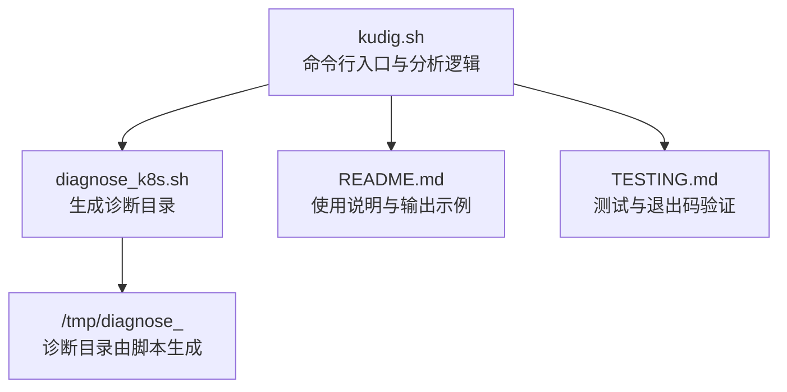
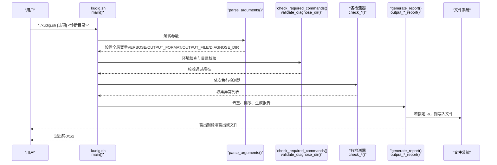
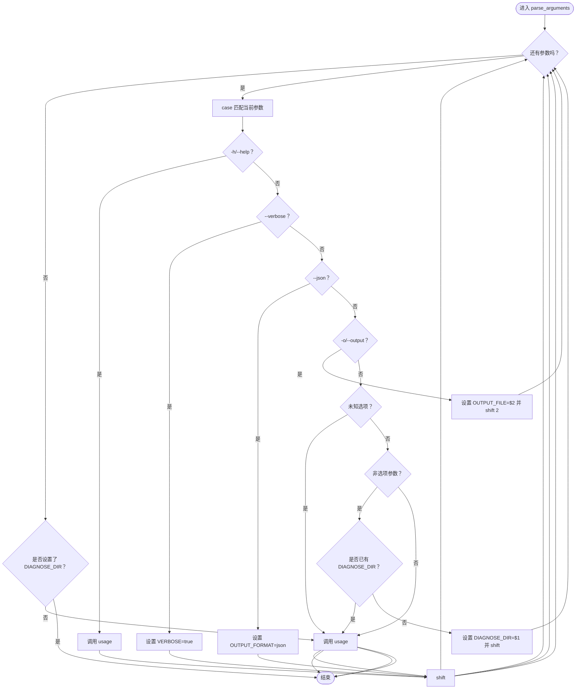

# 使用方法

<cite>
**本文引用的文件**
- [kudig.sh](file://kudig.sh)
- [diagnose_k8s.sh](file://reference/diagnose_k8s/diagnose_k8s.sh)
- [README.md](file://README.md)
- [TESTING.md](file://TESTING.md)
</cite>

## 目录
1. [简介](#简介)
2. [项目结构](#项目结构)
3. [核心组件](#核心组件)
4. [架构总览](#架构总览)
5. [详细组件分析](#详细组件分析)
6. [依赖关系分析](#依赖关系分析)
7. [性能考虑](#性能考虑)
8. [故障排除指南](#故障排除指南)
9. [结论](#结论)
10. [附录](#附录)

## 简介
本章节面向首次使用者与自动化运维工程师，系统性讲解 kudig.sh 的命令行接口与使用方法。重点覆盖：
- 基本用法 ./kudig.sh <诊断目录> 的参数来源与路径格式
- 所有命令行选项的语义与实现逻辑（--help、--version、--verbose、--json、-o/--output）
- 参数解析机制（getopts 风格的 while 循环与 parse_arguments 函数）
- 退出码含义及在自动化脚本中的应用
- 多个实用示例：基础分析、详细模式、JSON 输出、保存文件
- 故障排除：当用户忘记指定诊断目录时的错误检查与反馈

## 项目结构
kudig.sh 位于仓库根目录，配合参考脚本 diagnose_k8s.sh 生成诊断数据；README.md 提供使用说明与输出示例；TESTING.md 提供测试与退出码验证指引。

图表来源
- [kudig.sh](file://kudig.sh#L1-L120)
- [diagnose_k8s.sh](file://reference/diagnose_k8s/diagnose_k8s.sh#L1-L40)
- [README.md](file://README.md#L24-L67)
- [TESTING.md](file://TESTING.md#L9-L33)

章节来源
- [kudig.sh](file://kudig.sh#L1-L120)
- [diagnose_k8s.sh](file://reference/diagnose_k8s/diagnose_k8s.sh#L1-L40)
- [README.md](file://README.md#L24-L67)
- [TESTING.md](file://TESTING.md#L9-L33)

## 核心组件
- 命令行参数解析：parse_arguments 函数通过 while 循环处理选项，支持 -h/--help、-v/--version、--verbose、--json、-o/--output，并对诊断目录进行校验。
- 环境与输入校验：check_required_commands 检查必要命令；validate_diagnose_dir 校验诊断目录存在性与关键文件完整性。
- 异常检测器：涵盖系统资源、进程服务、网络、内核、容器运行时、Kubernetes 组件、时间同步与配置等维度。
- 报告生成：根据 OUTPUT_FORMAT 输出文本或 JSON；支持将报告写入文件（-o/--output）。
- 退出码策略：0 表示无异常；1 表示存在警告/提示；2 表示存在严重异常。

章节来源
- [kudig.sh](file://kudig.sh#L217-L258)
- [kudig.sh](file://kudig.sh#L121-L139)
- [kudig.sh](file://kudig.sh#L141-L168)
- [kudig.sh](file://kudig.sh#L1047-L1041)
- [kudig.sh](file://kudig.sh#L1237-L1308)
- [README.md](file://README.md#L223-L229)

## 架构总览
下图展示了从命令行到最终报告输出的整体流程，以及与诊断目录的关系。

图表来源
- [kudig.sh](file://kudig.sh#L1269-L1312)
- [kudig.sh](file://kudig.sh#L217-L258)
- [kudig.sh](file://kudig.sh#L121-L139)
- [kudig.sh](file://kudig.sh#L141-L168)
- [kudig.sh](file://kudig.sh#L1047-L1041)
- [kudig.sh](file://kudig.sh#L1237-L1308)

## 详细组件分析

### 命令行接口与参数解析
- **选项一览**
  - -h, --help：打印帮助信息并退出
  - -v, --version：打印版本信息并退出
  - --verbose：启用详细调试输出（向标准错误输出 INFO/DEBUG）
  - --json：输出 JSON 格式报告
  - -o, --output <文件>：将报告保存到指定文件
- **参数来源与路径格式**
  - <诊断目录> 由 diagnose_k8s.sh 生成，路径形如 /tmp/diagnose_<timestamp>，其中 timestamp 为 Unix 时间戳。
  - 该目录包含 system_info、service_status、system_status、network_info、memory_info、logs 等文件，以及可选的 daemon_status 子目录。
- **实现机制**
  - parse_arguments 使用 while 循环遍历参数，通过 case 分支处理长/短选项，遇到非选项时记录 DIAGNOSE_DIR。
  - 对未知选项调用 usage 并报错；若未提供诊断目录则调用 usage 并报错。
  - 选项处理后，主流程再调用 validate_diagnose_dir 校验目录存在性与关键文件。

章节来源
- [kudig.sh](file://kudig.sh#L62-L87)
- [kudig.sh](file://kudig.sh#L217-L258)
- [diagnose_k8s.sh](file://reference/diagnose_k8s/diagnose_k8s.sh#L1-L40)
- [README.md](file://README.md#L24-L67)

### 诊断目录的来源与路径格式
- **来源**：diagnose_k8s.sh 会在 /tmp 下创建以 diagnose_<timestamp> 命名的目录，并填充各类诊断文件。
- **路径格式**：/tmp/diagnose_<timestamp>，其中 timestamp 为当前时间戳。
- **关键文件（示例）**：system_info、service_status、system_status、network_info、memory_info、logs/dmesg.log、logs/kubelet.log 等。

章节来源
- [diagnose_k8s.sh](file://reference/diagnose_k8s/diagnose_k8s.sh#L1-L40)
- [README.md](file://README.md#L24-L67)

### 选项实现逻辑（parse_arguments 中的 case 处理）
- -h/--help：直接调用 usage 并退出
- -v/--version：直接调用 version 并退出
- --verbose：设置 VERBOSE=true，后续日志函数会输出详细信息
- --json：设置 OUTPUT_FORMAT="json"
- -o/--output：读取下一个参数作为文件名并赋给 OUTPUT_FILE
- 其他未知选项：调用 usage 并报错
- 非选项参数：若未设置 DIAGNOSE_DIR 则记录之，否则报错“只能指定一个诊断目录”

章节来源
- [kudig.sh](file://kudig.sh#L217-L258)

### 退出码含义与自动化应用
- 0：未检测到异常
- 1：检测到警告或提示级别异常
- 2：检测到严重级别异常
- 自动化脚本可据此判断是否需要告警或进一步处理。

章节来源
- [README.md](file://README.md#L223-L229)
- [kudig.sh](file://kudig.sh#L1292-L1308)

### 实用使用示例
- 基本分析：./kudig.sh /tmp/diagnose_1702468800
- 详细模式：./kudig.sh --verbose /tmp/diagnose_1702468800
- JSON 格式输出（用于 API 集成）：./kudig.sh --json /tmp/diagnose_1702468800 > report.json
- 保存报告到文件：./kudig.sh -o report.txt /tmp/diagnose_1702468800
- 组合使用多个选项：./kudig.sh --verbose --json -o report.json /tmp/diagnose_1702468800

章节来源
- [README.md](file://README.md#L48-L67)
- [TESTING.md](file://TESTING.md#L17-L33)

### 参数解析流程（算法级说明）

图表来源
- [kudig.sh](file://kudig.sh#L217-L258)

## 依赖关系分析
- **外部命令依赖**：脚本通过 check_required_commands 检查 grep、awk、sed、wc、sort、uniq、tail、head、find 等命令是否存在。
- **输入依赖**：诊断目录需由 diagnose_k8s.sh 生成，且包含若干关键文件（system_info、service_status、system_status、network_info、memory_info 等）。
- **输出依赖**：--json 选项依赖标准输出；-o 选项依赖文件写入权限。

章节来源
- [kudig.sh](file://kudig.sh#L121-L139)
- [diagnose_k8s.sh](file://reference/diagnose_k8s/diagnose_k8s.sh#L1-L40)

## 性能考虑
- 诊断目录越大，文件扫描与正则匹配耗时越长。建议仅分析最近一次的诊断目录，避免不必要的全量扫描。
- JSON 输出适合批量采集与二次处理，文本输出便于人工审阅。
- --verbose 会增加标准错误输出，对性能影响较小，但会增大输出体积。

## 故障排除指南
- **忘记指定诊断目录**
  - 现象：脚本调用 usage 并报错
  - 处理：确保提供正确的 /tmp/diagnose_<timestamp> 路径
- **诊断目录不存在**
  - 现象：validate_diagnose_dir 报错并退出
  - 处理：确认 diagnose_k8s.sh 是否成功执行并生成目录
- **缺少必要命令**
  - 现象：check_required_commands 报错并退出
  - 处理：安装缺失命令（如 grep、awk、sed、findutils 等）
- **诊断目录结构不完整**
  - 现象：脚本发出警告但仍继续分析
  - 处理：使用完整 diagnose_k8s.sh 收集数据，确保关键文件存在
- **无法读取某些日志文件**
  - 现象：对应检测项无结果
  - 处理：确认日志文件存在于诊断目录中，或检查权限

章节来源
- [kudig.sh](file://kudig.sh#L141-L168)
- [kudig.sh](file://kudig.sh#L121-L139)
- [README.md](file://README.md#L311-L337)

## 结论
kudig.sh 提供简洁而强大的命令行接口，结合 diagnose_k8s.sh 生成的诊断目录，能够快速定位 Kubernetes 节点的系统资源、进程服务、网络、内核、容器运行时与配置等方面的问题。通过 --verbose、--json、-o 等选项，既能满足人工审阅，也能无缝对接自动化与 API 集成。遵循本文提供的使用方法与故障排除建议，可在生产环境中稳定高效地部署与使用。

## 附录
- 诊断目录命名规范：/tmp/diagnose_<timestamp>
- 退出码速查：0（无异常）、1（警告/提示）、2（严重异常）
- 常用组合示例：./kudig.sh --verbose --json -o report.json /tmp/diagnose_1702468800