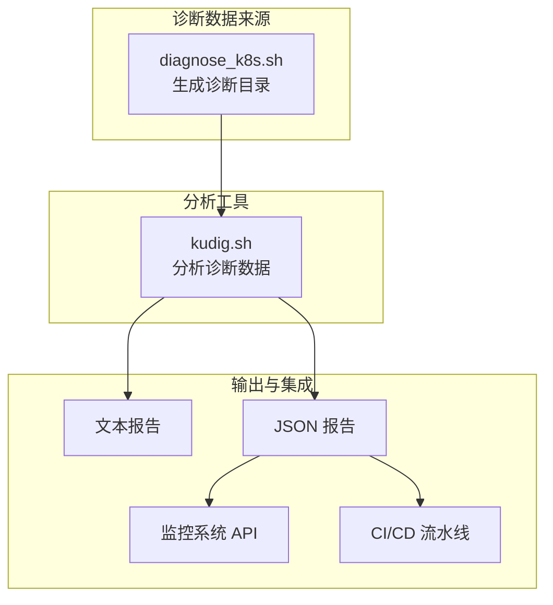
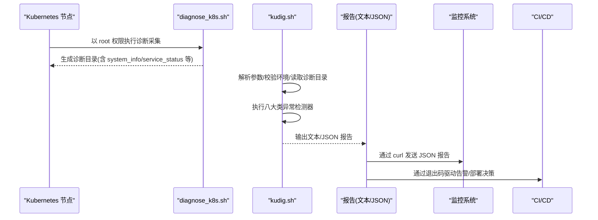
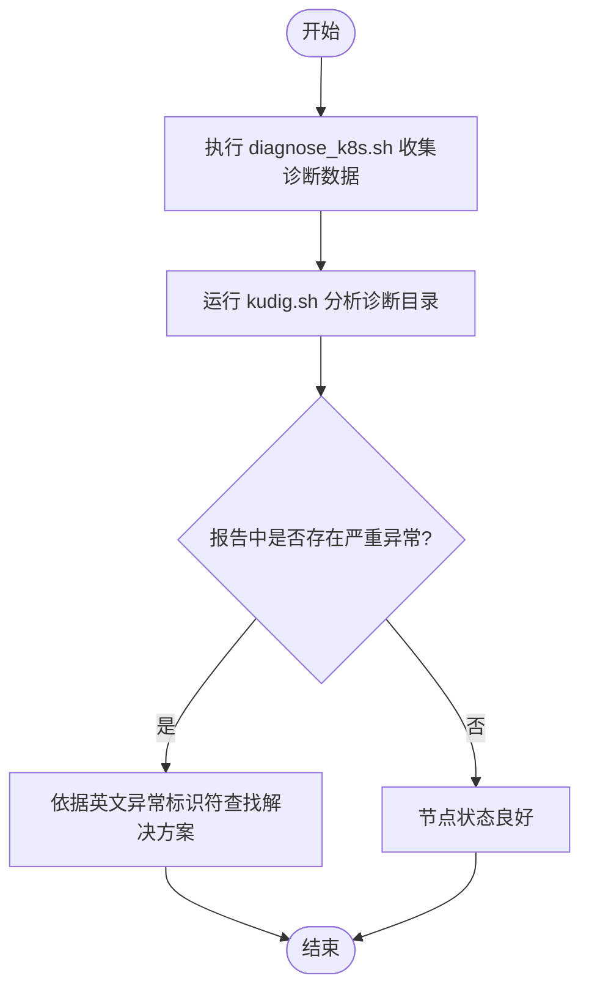
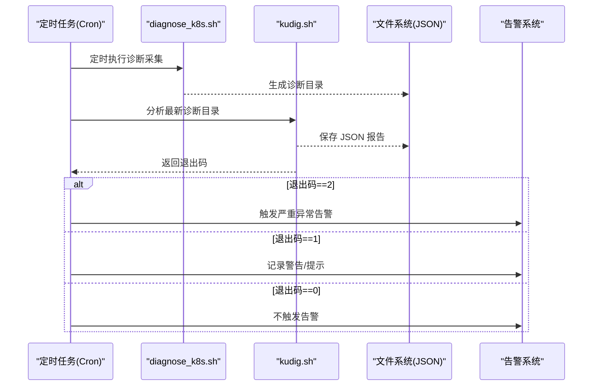
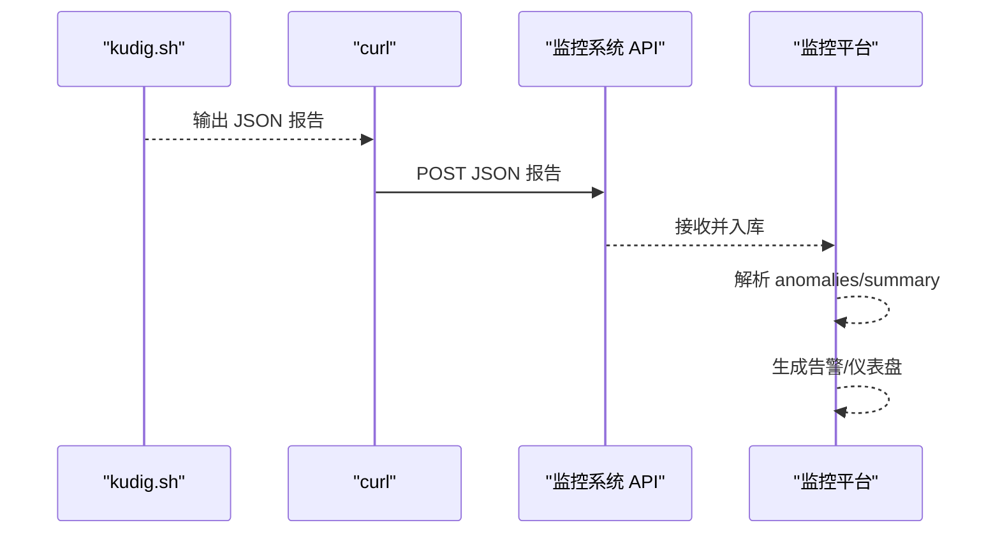
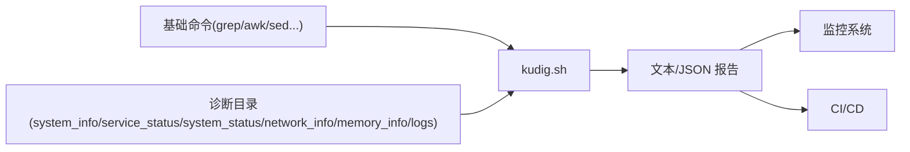

# 典型使用场景

<cite>
**本文引用的文件**
- [README.md](file://README.md)
- [kudig.sh](file://kudig.sh)
- [diagnose_k8s.sh](file://reference/diagnose_k8s/diagnose_k8s.sh)
- [TESTING.md](file://TESTING.md)
- [healthz.go](file://reference/healthz.go)
</cite>

## 目录
1. [简介](#简介)
2. [项目结构](#项目结构)
3. [核心组件](#核心组件)
4. [架构总览](#架构总览)
5. [详细场景分析](#详细场景分析)
6. [依赖关系分析](#依赖关系分析)
7. [性能考量](#性能考量)
8. [故障排查指南](#故障排查指南)
9. [结论](#结论)
10. [附录](#附录)

## 简介
本文围绕 kudig.sh 的三大典型运维场景展开：节点故障快速诊断、自动化巡检、与监控系统集成。文档基于仓库内的 README、脚本源码与测试说明，给出可落地的操作流程、最佳实践与排障建议，并解释各场景如何共同构成 kudig.sh 的核心用户工作流，从而降低 MTTR（平均修复时间）、提升主动运维能力。

## 项目结构
- kudig.sh：Kubernetes 节点诊断分析脚本，负责解析 diagnose_k8s.sh 生成的诊断数据，输出中英文对照报告，并通过退出码表达异常严重程度。
- reference/diagnose_k8s/diagnose_k8s.sh：采集节点诊断数据的参考脚本，生成包含 system_info、service_status、system_status、network_info、memory_info、logs 等子目录的诊断目录。
- reference/healthz.go：Kubernetes 健康检查机制的参考实现，便于理解健康检查在集群层面的含义，有助于对齐 kudig.sh 的异常标识符。
- TESTING.md：测试与验证说明，包含退出码约定、测试步骤与自动化测试脚本示例。

**图表来源**
- [kudig.sh](file://kudig.sh#L1266-L1312)
- [diagnose_k8s.sh](file://reference/diagnose_k8s/diagnose_k8s.sh#L1-L120)

**章节来源**
- [README.md](file://README.md#L237-L267)
- [kudig.sh](file://kudig.sh#L1266-L1312)
- [diagnose_k8s.sh](file://reference/diagnose_k8s/diagnose_k8s.sh#L1-L120)

## 核心组件
- 参数解析与环境校验：解析命令行参数、检查必要命令、验证诊断目录完整性。
- 异常检测器：覆盖系统资源、进程服务、网络、内核、容器运行时、Kubernetes 组件、时间同步、配置等八大类。
- 报告生成：支持文本与 JSON 两种输出格式；自动去重与按严重级别排序。
- 退出码策略：0 表示无异常；1 表示存在警告/提示；2 表示存在严重异常。

**章节来源**
- [kudig.sh](file://kudig.sh#L214-L259)
- [kudig.sh](file://kudig.sh#L1266-L1312)
- [README.md](file://README.md#L223-L230)

## 架构总览
下图展示了从数据采集到分析输出再到外部集成的整体流程。

**图表来源**
- [diagnose_k8s.sh](file://reference/diagnose_k8s/diagnose_k8s.sh#L1-L120)
- [kudig.sh](file://kudig.sh#L1266-L1312)
- [README.md](file://README.md#L302-L310)

## 详细场景分析

### 场景一：节点故障快速诊断
目标：在节点出现异常时，快速定位问题根因并指导修复。

- 操作流程
  1) 使用 diagnose_k8s.sh 收集诊断数据（需 root 权限）。
  2) 运行 kudig.sh 对诊断目录进行分析，得到中英文对照的异常报告。
  3) 根据报告中的英文异常标识符（如 KUBELET_SERVICE_DOWN、HIGH_SYSTEM_LOAD 等）在知识库或官方文档中查找对应解决方案。

- 关键要点
  - 诊断目录结构由 diagnose_k8s.sh 生成，包含 system_info、service_status、system_status、network_info、memory_info、logs 等关键文件。
  - kudig.sh 会自动去重并按严重级别排序，便于优先处理严重异常。
  - 英文异常标识符与 README 的“异常检测规则”一一对应，便于检索。

- 业务价值
  - 快速定位：通过统一的异常标识符，缩短定位时间。
  - 降低 MTTR：明确的异常分级与出处位置，加速修复闭环。

**图表来源**
- [README.md](file://README.md#L268-L310)
- [kudig.sh](file://kudig.sh#L1266-L1312)

**章节来源**
- [README.md](file://README.md#L268-L310)
- [kudig.sh](file://kudig.sh#L1266-L1312)

### 场景二：自动化巡检
目标：定期运行诊断，基于退出码触发告警，实现主动运维。

- 实施要点
  - 定时任务：周期性执行 diagnose_k8s.sh 收集最新诊断数据。
  - 分析与落盘：调用 kudig.sh 生成 JSON 报告并保存到固定路径。
  - 退出码判断：当退出码为 2（严重异常）时，触发告警通知（如邮件、IM、短信）。
  - 可选：将 JSON 报告写入日志归档，便于后续审计与趋势分析。

- 业务价值
  - 主动运维：在问题扩大前发现并处置，避免影响业务。
  - 降低人工巡检成本：自动化执行，减少重复劳动。
  - 与告警系统联动：统一的退出码与 JSON 格式，便于接入现有告警平台。

**图表来源**
- [README.md](file://README.md#L282-L301)
- [kudig.sh](file://kudig.sh#L1266-L1312)
- [TESTING.md](file://TESTING.md#L35-L42)

**章节来源**
- [README.md](file://README.md#L282-L301)
- [TESTING.md](file://TESTING.md#L35-L42)
- [kudig.sh](file://kudig.sh#L1266-L1312)

### 场景三：与监控系统集成
目标：将 kudig.sh 的 JSON 报告通过 HTTP 推送到监控系统的 API，实现可视化与持久化。

- 实施要点
  - 生成 JSON 报告：使用 kudig.sh --json 输出标准 JSON。
  - 发送至监控 API：使用 curl 将 JSON 数据 POST 到监控系统提供的接收端点。
  - 监控系统解析：在监控侧解析 anomalies 数组与 summary 字段，建立告警规则与仪表盘。
  - 可选：在监控侧对英文异常标识符进行映射，生成中文告警标题，提升可读性。

- 业务价值
  - 可视化：将诊断结果纳入统一监控面板，便于集中查看。
  - 持久化：长期留存 JSON 报告，支持回溯与趋势分析。
  - 协同：与现有告警平台无缝对接，减少二次开发成本。

**图表来源**
- [README.md](file://README.md#L302-L310)
- [kudig.sh](file://kudig.sh#L1181-L1235)

**章节来源**
- [README.md](file://README.md#L302-L310)
- [kudig.sh](file://kudig.sh#L1181-L1235)

### 场景四：与 CI/CD 集成（质量保障）
目标：在 CI/CD 流程中引入自动化测试，确保每次变更不影响诊断能力。

- 实施要点
  - 使用 TESTING.md 中的测试步骤与自动化测试脚本，验证帮助信息、版本信息、参数解析、输出格式、退出码等关键功能。
  - 在流水线中加入“kudig.sh 功能测试”阶段，确保新增规则或修复不会破坏既有行为。
  - 通过退出码断言（0/1/2）与 JSON 格式校验，保证输出稳定性。

- 业务价值
  - 提升质量：在合并前发现回归问题。
  - 降低风险：自动化测试覆盖关键路径，减少人工遗漏。
  - 保障交付：稳定的输出格式与退出码约定，便于下游系统稳定消费。

**章节来源**
- [TESTING.md](file://TESTING.md#L132-L176)
- [kudig.sh](file://kudig.sh#L1266-L1312)

## 依赖关系分析
- 外部命令依赖：kudig.sh 依赖 grep、awk、sed、wc、sort、uniq、tail、head、find 等基础命令，若缺失会在启动阶段报错并退出。
- 诊断目录结构：kudig.sh 通过读取 system_info、service_status、system_status、network_info、memory_info、logs 等文件进行分析；若关键文件缺失，会发出警告但仍继续分析。
- 异常标识符一致性：英文异常标识符与 README 的“异常检测规则”表格保持一致，便于知识库检索与自动化处理。

**图表来源**
- [kudig.sh](file://kudig.sh#L117-L139)
- [kudig.sh](file://kudig.sh#L141-L168)
- [README.md](file://README.md#L139-L223)

**章节来源**
- [kudig.sh](file://kudig.sh#L117-L139)
- [kudig.sh](file://kudig.sh#L141-L168)
- [README.md](file://README.md#L139-L223)

## 性能考量
- I/O 开销：诊断目录通常较大，建议在具备足够磁盘空间与带宽的环境中执行，避免在 IO 繁忙时段运行。
- 并发与超时：diagnose_k8s.sh 中对部分命令设置了超时，kudig.sh 仅做只读分析，整体耗时主要取决于诊断目录规模。
- 输出格式选择：JSON 输出便于机器解析与传输，文本输出便于人工审阅；在自动化场景中推荐 JSON。

[本节为通用建议，不直接分析具体文件]

## 故障排查指南
- 缺少必要命令：kudig.sh 会在启动时检查命令是否存在，缺失时会提示安装并退出。请根据提示安装相应软件包。
- 诊断目录结构不完整：若关键文件缺失，脚本会发出警告但仍继续分析。建议使用完整的 diagnose_k8s.sh 生成诊断数据。
- 无法读取某些日志文件：检查诊断数据收集时的权限与文件存在性。
- 退出码异常：根据 TESTING.md 的约定，0/1/2 分别代表无异常、警告/提示、严重异常。结合报告内容定位问题。

**章节来源**
- [README.md](file://README.md#L311-L338)
- [TESTING.md](file://TESTING.md#L177-L197)
- [kudig.sh](file://kudig.sh#L117-L139)

## 结论
kudig.sh 通过“数据采集—分析—报告—集成”的闭环，将节点诊断从被动响应转为主动运维的关键抓手。三大场景分别覆盖了应急处置、日常巡检与系统集成，配合统一的英文异常标识符与退出码约定，能够有效降低 MTTR、提升可观测性与自动化水平。结合 CI/CD 的质量保障，可进一步确保工具的稳定性与演进质量。

[本节为总结性内容，不直接分析具体文件]

## 附录

### 附录A：异常标识符与严重级别对照
- 严重级别：KUBELET_SERVICE_DOWN、HIGH_SYSTEM_LOAD、HIGH_MEMORY_USAGE、DISK_SPACE_CRITICAL 等。
- 警告级别：CONNTRACK_TABLE_HIGH_USAGE、ELEVATED_SYSTEM_LOAD、ELEVATED_MEMORY_USAGE 等。
- 提示级别：SWAP_NOT_DISABLED、TIME_SYNC_SERVICE_DOWN 等。

**章节来源**
- [README.md](file://README.md#L139-L223)

### 附录B：退出码约定
- 0：未检测到异常
- 1：检测到警告或提示级别异常
- 2：检测到严重级别异常

**章节来源**
- [README.md](file://README.md#L223-L230)
- [TESTING.md](file://TESTING.md#L35-L42)

### 附录C：健康检查参考
- 可参考 healthz.go 中的健康检查注册与端点安装逻辑，理解健康检查在集群层面的含义，有助于对齐 kudig.sh 的异常标识符与集群健康状态。

**章节来源**
- [healthz.go](file://reference/healthz.go#L1-L168)