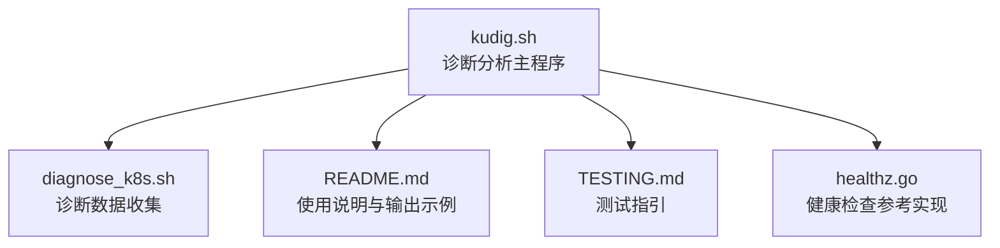
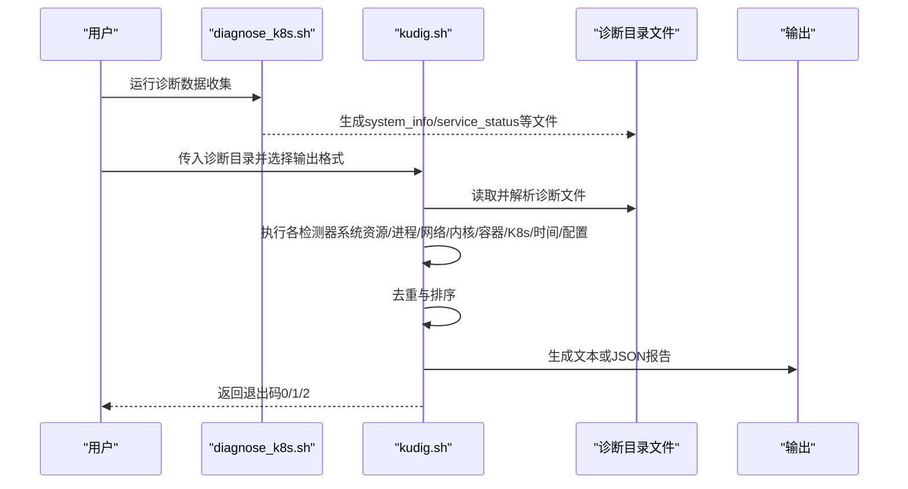
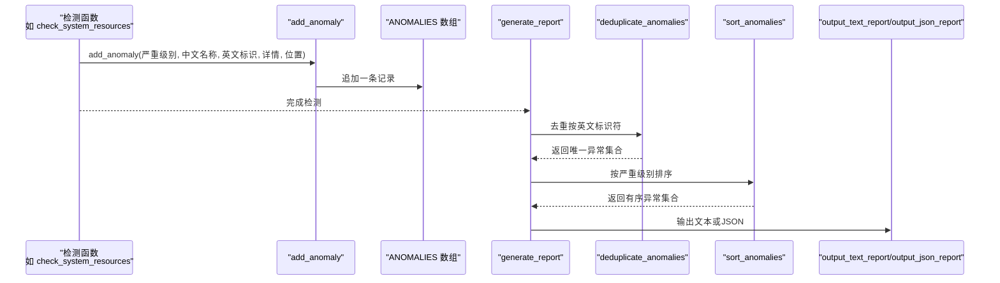
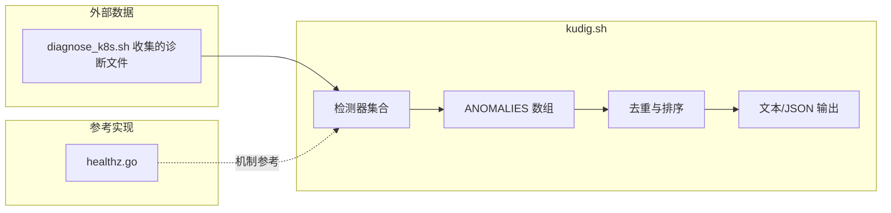

# 功能特性

<cite>
**本文引用的文件**
- [kudig.sh](file://kudig.sh)
- [README.md](file://README.md)
- [TESTING.md](file://TESTING.md)
- [reference/diagnose_k8s/diagnose_k8s.sh](file://reference/diagnose_k8s/diagnose_k8s.sh)
- [reference/healthz.go](file://reference/healthz.go)
</cite>

## 目录
1. [简介](#简介)
2. [项目结构](#项目结构)
3. [核心组件](#核心组件)
4. [架构总览](#架构总览)
5. [详细组件分析](#详细组件分析)
6. [依赖关系分析](#依赖关系分析)
7. [性能考量](#性能考量)
8. [故障排查指南](#故障排查指南)
9. [结论](#结论)
10. [附录](#附录)

## 简介
本文件围绕 kudig.sh 的功能特性展开，重点阐述以下能力：
- 全面的异常检测：覆盖系统资源、进程服务、网络、内核、容器运行时、Kubernetes 组件、时间同步与配置等八大类检测。
- 双语输出：在 ANOMALIES 数组中同时存储中文名称与英文标识符，在报告生成时统一输出。
- 严重级别分类：通过 SEVERITY_CRITICAL、SEVERITY_WARNING、SEVERITY_INFO 常量定义与 add_anomaly 应用，实现分级输出。
- 多种输出格式：文本格式与 JSON 格式，分别强调可读性与机器可读性。
- 本地化分析：完全在本地运行，不依赖外部服务或网络连接。
- 智能去重：在报告生成前对 ANOMALIES 数组进行排序与去重处理。

## 项目结构
kudig.sh 由单一脚本构成，配合参考工具 diagnose_k8s.sh 生成诊断数据，README.md 提供使用说明与输出示例，TESTING.md 提供测试指引，healthz.go 展示 Kubernetes 健康检查机制的参考实现。

图表来源
- [kudig.sh](file://kudig.sh#L1-L120)
- [reference/diagnose_k8s/diagnose_k8s.sh](file://reference/diagnose_k8s/diagnose_k8s.sh#L1-L60)
- [README.md](file://README.md#L1-L40)
- [TESTING.md](file://TESTING.md#L1-L40)
- [reference/healthz.go](file://reference/healthz.go#L1-L40)

章节来源
- [kudig.sh](file://kudig.sh#L1-L120)
- [reference/diagnose_k8s/diagnose_k8s.sh](file://reference/diagnose_k8s/diagnose_k8s.sh#L1-L60)
- [README.md](file://README.md#L1-L40)
- [TESTING.md](file://TESTING.md#L1-L40)
- [reference/healthz.go](file://reference/healthz.go#L1-L40)

## 核心组件
- 全局变量与常量
  - ANOMALIES 数组：存储异常条目，格式为“严重级别|中文名称|英文标识|详情|位置”。
  - SEVERITY_* 常量：定义严重级别枚举（严重、警告、提示）。
  - 输出格式与文件：OUTPUT_FORMAT 控制文本/JSON；OUTPUT_FILE 控制保存路径。
- 工具函数
  - add_anomaly：向 ANOMALIES 添加异常条目。
  - safe_cat/safe_line_count/extract_number：安全读取文件与数值提取。
  - pattern_exists/count_pattern_in_log：基于 grep 的模式匹配与计数。
  - get_* 函数族：从诊断文件中抽取 CPU、内存、负载、连接跟踪等关键指标。
- 检测器
  - check_system_resources、check_process_services、check_network、check_kernel、check_container_runtime、check_kubernetes、check_time_sync、check_configuration。
- 报告生成
  - deduplicate_anomalies：按英文标识符去重。
  - sort_anomalies：按严重级别排序。
  - output_text_report、output_json_report：文本与 JSON 输出。
  - generate_report：统一调度去重、排序与输出。
- 主流程
  - main：参数解析、环境检查、执行各检测器、生成报告并根据异常数量返回退出码。

章节来源
- [kudig.sh](file://kudig.sh#L35-L70)
- [kudig.sh](file://kudig.sh#L170-L212)
- [kudig.sh](file://kudig.sh#L260-L368)
- [kudig.sh](file://kudig.sh#L417-L1041)
- [kudig.sh](file://kudig.sh#L1043-L1312)

## 架构总览
kudig.sh 的整体工作流如下：先由 diagnose_k8s.sh 收集节点诊断数据，再由 kudig.sh 对诊断数据进行多维度异常检测，最终生成文本或 JSON 报告，并返回合适的退出码。

图表来源
- [reference/diagnose_k8s/diagnose_k8s.sh](file://reference/diagnose_k8s/diagnose_k8s.sh#L1-L120)
- [kudig.sh](file://kudig.sh#L1266-L1312)

章节来源
- [reference/diagnose_k8s/diagnose_k8s.sh](file://reference/diagnose_k8s/diagnose_k8s.sh#L1-L120)
- [kudig.sh](file://kudig.sh#L1266-L1312)

## 详细组件分析

### 全面的异常检测（八大类）
- 系统资源
  - 负载、内存、磁盘、文件句柄、线程数、inode 使用率等。
  - 关键函数：check_system_resources。
- 进程与服务
  - kubelet、容器运行时（docker/containerd）、ps 命令挂起、D 状态进程、runc 挂起、防火墙状态等。
  - 关键函数：check_process_services。
- 网络
  - 连接跟踪表、网卡状态、默认路由、kubelet 端口监听、iptables 规则数量等。
  - 关键函数：check_network。
- 内核
  - 内核 panic、OOM Killer、只读文件系统、IO 错误、内核模块加载失败、NMI watchdog 等。
  - 关键函数：check_kernel。
- 容器运行时
  - Docker 启动失败、存储驱动错误、容器创建失败率、镜像拉取失败等。
  - 关键函数：check_container_runtime。
- Kubernetes 组件
  - PLEG 不健康、CNI 插件错误、证书过期/将过期、API Server 连接失败、认证失败、Pod 驱逐、节点 NotReady、磁盘/内存压力等。
  - 关键函数：check_kubernetes。
- 时间同步
  - ntpd/chronyd 未运行。
  - 关键函数：check_time_sync。
- 配置
  - Swap 未禁用、IP 转发未启用、bridge-nf-call-iptables 未启用、ulimit 过低、SELinux Enforcing 等。
  - 关键函数：check_configuration。

章节来源
- [kudig.sh](file://kudig.sh#L417-L1041)

### 双语输出机制
- 数据结构
  - ANOMALIES 数组每条记录包含“严重级别|中文名称|英文标识|详情|位置”，其中中文名称用于人类可读，英文标识用于统一输出与去重。
- 输出策略
  - 文本报告：按严重级别分组输出，同时展示中文名称与英文标识。
  - JSON 报告：输出字段包含 severity、cn_name、en_name、details、location，便于下游系统消费。
- 关键实现
  - add_anomaly：统一写入 ANOMALIES。
  - output_text_report/output_json_report：分别渲染文本与 JSON。
  - generate_report：在输出前先去重与排序。

章节来源
- [kudig.sh](file://kudig.sh#L35-L70)
- [kudig.sh](file://kudig.sh#L170-L181)
- [kudig.sh](file://kudig.sh#L1047-L1090)
- [kudig.sh](file://kudig.sh#L1091-L1235)

### 严重级别分类机制
- 常量定义
  - SEVERITY_CRITICAL、SEVERITY_WARNING、SEVERITY_INFO。
- 应用方式
  - add_anomaly 在添加异常时指定严重级别。
  - sort_anomalies 按严重级别排序（严重优先）。
  - generate_report 输出前排序，保证严重异常优先呈现。
- 退出码
  - main 根据严重异常数量决定退出码（0/1/2）。

章节来源
- [kudig.sh](file://kudig.sh#L53-L57)
- [kudig.sh](file://kudig.sh#L170-L181)
- [kudig.sh](file://kudig.sh#L1067-L1089)
- [kudig.sh](file://kudig.sh#L1292-L1307)

### 多种输出格式
- 文本格式
  - 可读性强，适合人工审阅；按严重级别分段输出，包含中文名称、英文标识、详情与位置。
  - 关键函数：output_text_report。
- JSON 格式
  - 字段标准化，便于机器解析与集成；包含 anomalies 数组与 summary 统计。
  - 关键函数：output_json_report。
- 生成流程
  - generate_report：统一调度去重、排序与输出；支持保存到文件。

章节来源
- [kudig.sh](file://kudig.sh#L1091-L1235)
- [README.md](file://README.md#L70-L137)

### 本地化分析优势
- 完全在本地执行，不依赖外部服务或网络连接。
- 通过安全读取函数（safe_cat、safe_line_count）避免因文件缺失导致的中断。
- 环境检查与参数解析确保脚本在可用条件下运行。

章节来源
- [kudig.sh](file://kudig.sh#L121-L139)
- [kudig.sh](file://kudig.sh#L214-L258)
- [kudig.sh](file://kudig.sh#L183-L212)

### 智能去重与排序
- 去重策略
  - deduplicate_anomalies：以英文标识符为键进行去重，避免同一异常重复报告。
- 排序策略
  - sort_anomalies：按严重级别（严重→警告→提示）顺序排列，提升可读性与优先级表达。
- 执行时机
  - generate_report 在输出前统一执行去重与排序。

章节来源
- [kudig.sh](file://kudig.sh#L1047-L1090)

### 代码级协作示例
以下序列图展示了检测函数如何调用 add_anomaly 添加异常，以及后续的去重与排序流程。

图表来源
- [kudig.sh](file://kudig.sh#L170-L181)
- [kudig.sh](file://kudig.sh#L1047-L1090)
- [kudig.sh](file://kudig.sh#L1091-L1235)

章节来源
- [kudig.sh](file://kudig.sh#L170-L181)
- [kudig.sh](file://kudig.sh#L1047-L1090)
- [kudig.sh](file://kudig.sh#L1091-L1235)

## 依赖关系分析
- 内部依赖
  - 检测器之间相互独立，共享 ANOMALIES 数组与工具函数。
  - 报告生成阶段依赖去重与排序函数。
- 外部依赖
  - 诊断数据来源于 diagnose_k8s.sh 收集的文件。
  - healthz.go 展示 Kubernetes 健康检查机制，有助于理解 K8s 组件健康度量。

图表来源
- [kudig.sh](file://kudig.sh#L417-L1312)
- [reference/diagnose_k8s/diagnose_k8s.sh](file://reference/diagnose_k8s/diagnose_k8s.sh#L1-L120)
- [reference/healthz.go](file://reference/healthz.go#L1-L40)

章节来源
- [kudig.sh](file://kudig.sh#L417-L1312)
- [reference/diagnose_k8s/diagnose_k8s.sh](file://reference/diagnose_k8s/diagnose_k8s.sh#L1-L120)
- [reference/healthz.go](file://reference/healthz.go#L1-L40)

## 性能考量
- I/O 与正则匹配
  - 多处使用 grep/awk/sed 等工具进行文本匹配与数值提取，建议在大规模日志场景下关注 I/O 与 CPU 开销。
- 去重与排序
  - 去重基于哈希表，排序基于线性扫描分组，整体复杂度与异常数量线性相关。
- 并发与超时
  - 诊断数据收集阶段对部分命令设置了超时，避免长时间阻塞；kudig.sh 本身为单进程脚本，未引入并发。

章节来源
- [reference/diagnose_k8s/diagnose_k8s.sh](file://reference/diagnose_k8s/diagnose_k8s.sh#L1-L40)
- [kudig.sh](file://kudig.sh#L1047-L1090)

## 故障排查指南
- 常见问题
  - 缺少必要命令：脚本会列出缺失命令并退出。
  - 诊断目录结构不完整：脚本会发出警告但仍继续分析可用文件。
  - 某些检测项无结果：可能是对应日志文件缺失，属正常现象。
- 验证方法
  - 使用 --help/--version 验证脚本可用性。
  - 使用 --json 输出并用工具校验 JSON 格式。
  - 使用 -o 保存报告以便离线分析。

章节来源
- [kudig.sh](file://kudig.sh#L121-L139)
- [TESTING.md](file://TESTING.md#L1-L120)
- [README.md](file://README.md#L312-L362)

## 结论
kudig.sh 通过“全面的异常检测 + 双语输出 + 严重级别分类 + 多种输出格式 + 本地化分析 + 智能去重与排序”的组合，构建了一个高效、准确且易于集成的 Kubernetes 节点诊断工具。其设计强调可读性与可集成性并重，既适合人工审阅，也便于接入自动化监控与告警体系。

## 附录
- 使用示例与输出示例可参考 README.md。
- 测试流程与预期输出可参考 TESTING.md。
- Kubernetes 健康检查机制可参考 healthz.go。

章节来源
- [README.md](file://README.md#L47-L137)
- [TESTING.md](file://TESTING.md#L69-L131)
- [reference/healthz.go](file://reference/healthz.go#L1-L40)