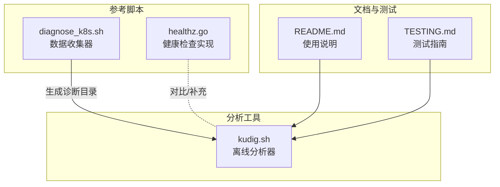
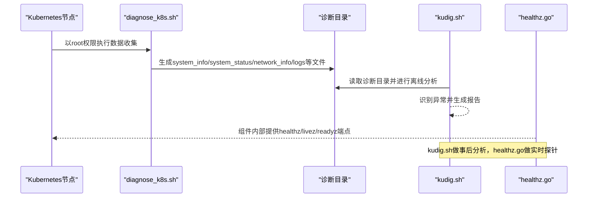
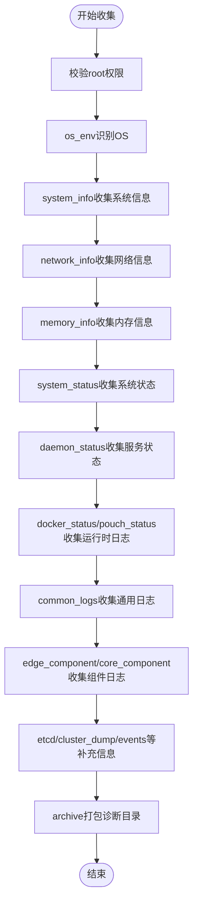
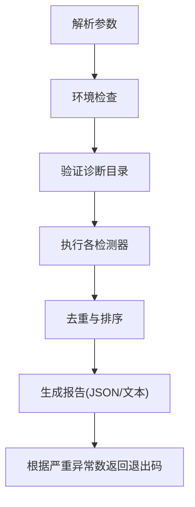
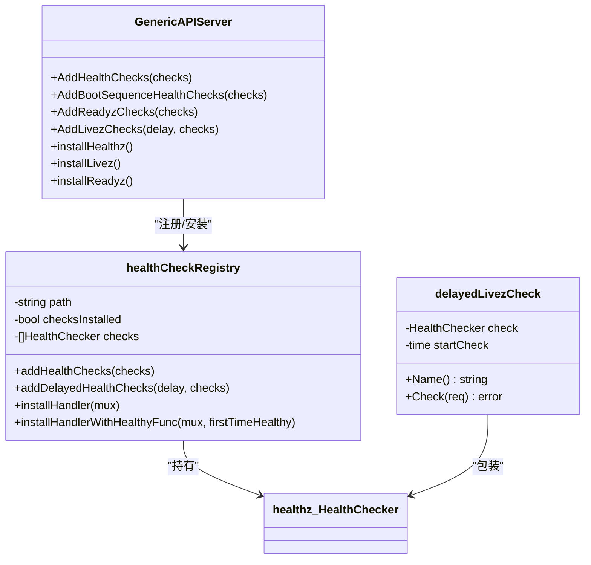
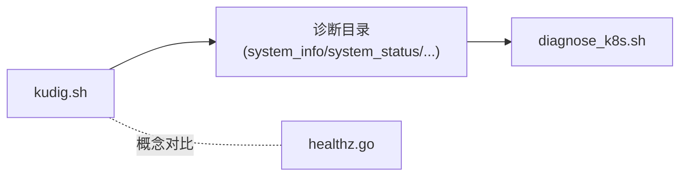

# 参考资料

<cite>
**本文引用的文件**
- [kudig.sh](file://kudig.sh)
- [diagnose_k8s.sh](file://reference/diagnose_k8s/diagnose_k8s.sh)
- [healthz.go](file://reference/healthz.go)
- [README.md](file://README.md)
- [TESTING.md](file://TESTING.md)
</cite>

## 目录
1. [简介](#简介)
2. [项目结构](#项目结构)
3. [核心组件](#核心组件)
4. [架构总览](#架构总览)
5. [详细组件分析](#详细组件分析)
6. [依赖分析](#依赖分析)
7. [性能考虑](#性能考虑)
8. [故障排查指南](#故障排查指南)
9. [结论](#结论)
10. [附录](#附录)

## 简介
本文件围绕 kudig.sh 参考资料进行系统化整理，重点解释其与相关组件的关系，特别是与 diagnose_k8s.sh 的数据采集关系，以及与 Kubernetes 原生健康检查机制 healthz.go 的对比与互补。通过对 diagnose_k8s.sh 的角色定位、关键函数与输出目录结构的梳理，说明其如何为 kudig.sh 提供离线分析所需的系统、服务、网络、日志等数据；并通过 healthz.go 的核心概念（健康检查接口、livez/readyz 端点、AddHealthChecks 方法）阐述 Kubernetes 组件内部的实时健康检查能力，从而帮助读者理解“离线诊断”与“在线健康检查”的分工与协作。

## 项目结构
仓库包含以下与本文主题直接相关的文件：
- reference/diagnose_k8s/diagnose_k8s.sh：节点诊断数据收集脚本，负责以 root 权限采集系统、服务、网络、日志等信息，并生成诊断目录。
- reference/healthz.go：Kubernetes 健康检查注册与端点实现，展示健康检查接口、livez/readyz 端点及 AddHealthChecks 方法。
- kudig.sh：基于 diagnose_k8s.sh 输出的诊断目录进行离线分析，识别异常并生成中英文对照报告。
- README.md：工具使用说明、工作流程、异常检测规则与输出示例。
- TESTING.md：测试方法与预期输出示例，便于验证工具链的正确性。

图表来源
- [diagnose_k8s.sh](file://reference/diagnose_k8s/diagnose_k8s.sh#L1-L506)
- [healthz.go](file://reference/healthz.go#L1-L168)
- [kudig.sh](file://kudig.sh#L1-L1312)
- [README.md](file://README.md#L1-L362)
- [TESTING.md](file://TESTING.md#L1-L197)

章节来源
- [README.md](file://README.md#L1-L362)

## 核心组件
- diagnose_k8s.sh：以 root 权限运行，收集系统、服务、网络、日志、容器运行时、Kubernetes 组件等信息，生成结构化的诊断目录，供后续离线分析。
- kudig.sh：读取 diagnose_k8s.sh 生成的诊断目录，按预设规则进行异常检测，输出中英文对照的文本或 JSON 报告，并根据异常严重程度返回退出码。
- healthz.go：Kubernetes 健康检查机制的实现，提供 healthz、livez、readyz 端点注册与延迟健康检查配置，体现组件内部的实时健康状态。

章节来源
- [diagnose_k8s.sh](file://reference/diagnose_k8s/diagnose_k8s.sh#L1-L506)
- [kudig.sh](file://kudig.sh#L1-L1312)
- [healthz.go](file://reference/healthz.go#L1-L168)

## 架构总览
下图展示了 kudig.sh 与 diagnose_k8s.sh、healthz.go 的关系：前者作为离线分析器消费后者提供的诊断数据，后者则代表 Kubernetes 组件内部的实时健康检查能力。

图表来源
- [diagnose_k8s.sh](file://reference/diagnose_k8s/diagnose_k8s.sh#L1-L506)
- [kudig.sh](file://kudig.sh#L1-L1312)
- [healthz.go](file://reference/healthz.go#L1-L168)

## 详细组件分析

### diagnose_k8s.sh：数据收集器
- 角色与权限
  - 以 root 权限运行，确保能访问系统关键信息与日志。
  - 生成 /tmp/diagnose_<timestamp> 诊断目录，包含子目录如 daemon_status、logs 等，便于后续分析。
- 关键函数与职责
  - os_env：识别操作系统类型，为后续兼容性判断提供依据。
  - system_info：收集内核版本、发行版信息、ulimit、sysctl、vmstat 等系统信息。
  - network_info：收集网卡、路由、iptables、连接跟踪表、netstat 等网络信息。
  - memory_info：收集内存相关统计，辅助内存压力检测。
  - system_status：收集负载、进程、端口监听、磁盘、挂载、rpm 包、dbus、进程树、文件句柄、PID 泄漏等。
  - check_ps_hang：检测 ps -ef 是否挂起，定位 D 状态进程并打印堆栈。
  - daemon_status：收集 systemd 单元状态（docker、containerd、kubelet、edge-hub 等）。
  - docker_status/pouch_status：收集容器运行时状态、版本、事件日志等。
  - common_logs：收集 dmesg、messages、journalctl 日志（kubelet、edge-hub、docker/containerd），并处理不同发行版差异。
  - kubelet_status/edgehub_status：收集 kubelet/edge-hub 进程与配置文件。
  - node_cache：复制 edge-hub 缓存目录。
  - core_component/edge_component：收集 kube-system 与边缘组件的日志。
  - etcd/cluster_dump/events/storageplugins/edgeadm_logs：补充 etcd、集群导出、事件、存储插件、edgeadm 日志。
  - sandbox_runtime_status：下载并执行沙箱运行时诊断脚本，收集状态。
  - pd_collect：编排上述函数，形成完整数据采集流程。
  - archive/upload_oss：打包诊断目录并可选上传到 OSS。
- 与 kudig.sh 的输入匹配
  - kudig.sh 依赖的输入文件包括 system_info、system_status、network_info、memory_info、daemon_status、logs 等。diagnose_k8s.sh 的输出目录结构与这些文件一一对应，保证 kudig.sh 能按路径解析并提取所需字段。

图表来源
- [diagnose_k8s.sh](file://reference/diagnose_k8s/diagnose_k8s.sh#L1-L506)

章节来源
- [diagnose_k8s.sh](file://reference/diagnose_k8s/diagnose_k8s.sh#L1-L506)

### kudig.sh：离线分析器
- 输入要求
  - 诊断目录需包含 system_info、service_status、system_status 等关键文件；即使部分缺失也会继续分析，但可能降低检测覆盖度。
- 分析流程
  - 参数解析：支持 --help、--version、--verbose、--json、-o 等选项。
  - 环境检查：校验必要命令是否存在。
  - 异常检测器：按类别执行检测，包括系统资源、进程服务、网络、内核、容器运行时、Kubernetes 组件、时间同步、配置等。
  - 报告生成：去重与排序后输出文本或 JSON 格式报告，并写入文件（可选）。
  - 退出码：0（无异常）、1（有警告/提示）、2（有严重异常）。
- 与 diagnose_k8s.sh 的输入匹配
  - kudig.sh 通过解析诊断目录下的文件路径与内容，提取 CPU 核心数、负载、内存使用率、磁盘使用率、文件句柄、进程线程数、连接跟踪表、网卡状态、路由、端口监听、内核 panic/OOM、容器运行时错误、Kubelet 错误、证书状态、API Server 连接失败、节点压力等指标，与 diagnose_k8s.sh 的输出一一对应。

图表来源
- [kudig.sh](file://kudig.sh#L1-L1312)

章节来源
- [kudig.sh](file://kudig.sh#L1-L1312)
- [README.md](file://README.md#L1-L362)

### healthz.go：Kubernetes 健康检查机制
- 核心概念
  - healthz.HealthChecker 接口：定义健康检查的 Name 与 Check 方法，用于注册具体检查项。
  - healthz.InstallPathHandlerWithHealthyFunc：安装健康检查处理器，支持首次健康回调。
  - livez/readyz：分别表示“存活”和“就绪”，其中 livez 可配置宽限期延迟，readyz 通常无宽限期。
  - AddHealthChecks/AddBootSequenceHealthChecks：向 healthz/livez/readyz 注册健康检查，后者还支持 livez 的宽限期配置。
- 与 kudig.sh 的对比与补充
  - healthz.go 展示的是组件内部的实时健康检查，面向运行时状态；kudig.sh 是离线分析，面向历史日志与静态数据。二者互补：实时探针发现即时问题，离线分析挖掘深层原因与历史趋势。

图表来源
- [healthz.go](file://reference/healthz.go#L1-L168)

章节来源
- [healthz.go](file://reference/healthz.go#L1-L168)

## 依赖分析
- 组件耦合
  - kudig.sh 对 diagnose_k8s.sh 的输出目录结构存在强依赖：system_info、system_status、network_info、memory_info、daemon_status、logs 等文件名与路径需保持一致。
  - healthz.go 与 kudig.sh 无直接代码依赖，但共享“健康检查”的概念边界：前者关注组件内部实时状态，后者关注节点与组件的历史与综合表现。
- 外部依赖
  - kudig.sh 依赖 grep、awk、sed、wc、sort、uniq、tail、head、find 等基础命令。
  - diagnose_k8s.sh 依赖 systemd/journald、journalctl、docker/containerd/pouch、kubectl 等工具与权限。

图表来源
- [kudig.sh](file://kudig.sh#L1-L1312)
- [diagnose_k8s.sh](file://reference/diagnose_k8s/diagnose_k8s.sh#L1-L506)
- [healthz.go](file://reference/healthz.go#L1-L168)

章节来源
- [kudig.sh](file://kudig.sh#L1-L1312)
- [diagnose_k8s.sh](file://reference/diagnose_k8s/diagnose_k8s.sh#L1-L506)
- [healthz.go](file://reference/healthz.go#L1-L168)

## 性能考虑
- diagnose_k8s.sh
  - 部分命令带超时保护（如 run 函数），避免长时间阻塞导致整体耗时过长。
  - 对 ps -ef 挂起检测与 D 状态进程定位，有助于发现系统级阻塞问题，减少无效分析。
- kudig.sh
  - 通过安全读取与正则匹配提取关键指标，避免复杂计算开销。
  - 去重与排序在异常较少时开销可控，适合大规模日志分析场景。
- healthz.go
  - livez 支持宽限期延迟，避免因启动阶段抖动导致误判；readyz 无宽限期，确保就绪信号准确反映业务可用性。

[本节为一般性指导，不涉及具体文件分析]

## 故障排查指南
- diagnose_k8s.sh
  - 必须以 root 权限执行，否则无法读取关键信息。
  - 若 ps -ef 挂起，脚本会记录并尝试定位 D 状态进程；此时 system_status 中会包含相应标记。
  - 日志收集依赖 systemd/journald 与 docker/containerd/pouch；若工具缺失或状态异常，会影响日志完整性。
- kudig.sh
  - 若诊断目录结构不完整，会显示警告但仍继续分析；建议使用完整版 diagnose_k8s.sh 收集数据。
  - 命令缺失会导致环境检查失败；根据提示安装缺失命令。
  - 退出码可用于自动化告警：0 表示无异常，1 表示存在警告/提示，2 表示存在严重异常。
- healthz.go
  - livez/readyz 端点由组件内部安装；若健康检查未生效，需确认注册逻辑与端点路径是否正确。

章节来源
- [diagnose_k8s.sh](file://reference/diagnose_k8s/diagnose_k8s.sh#L1-L506)
- [kudig.sh](file://kudig.sh#L1-L1312)
- [TESTING.md](file://TESTING.md#L1-L197)

## 结论
- diagnose_k8s.sh 作为数据收集器，以 root 权限生成标准化的诊断目录，为 kudig.sh 的离线分析提供可靠输入。
- kudig.sh 基于诊断目录进行多维度异常检测，输出中英文对照报告，并通过退出码支持自动化运维。
- healthz.go 代表 Kubernetes 组件内部的实时健康检查能力，与 kudig.sh 的离线分析形成互补：前者关注“当下”，后者关注“过去与综合”。

[本节为总结性内容，不涉及具体文件分析]

## 附录

### 获取方式与使用建议
- 获取方式
  - 从仓库根目录直接使用 kudig.sh 与 reference 下的 diagnose_k8s.sh、healthz.go。
  - 参考 README.md 了解使用方法与输出示例。
- 使用建议
  - 诊断数据收集：在目标节点以 root 权限执行 diagnose_k8s.sh，生成诊断目录。
  - 离线分析：在任意 Linux 环境（无需 root）运行 kudig.sh，读取诊断目录并生成报告。
  - 与监控集成：使用 --json 输出，结合 curl 或其他工具将报告推送至监控系统。
  - 测试验证：参考 TESTING.md 的测试步骤与预期输出，验证工具链的正确性。

章节来源
- [README.md](file://README.md#L1-L362)
- [TESTING.md](file://TESTING.md#L1-L197)