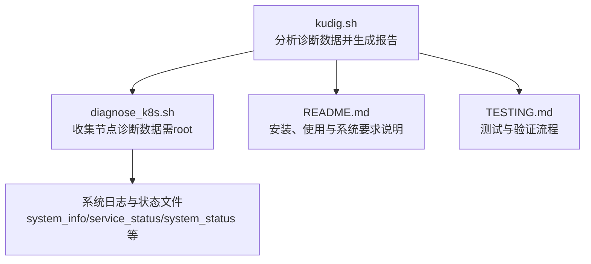
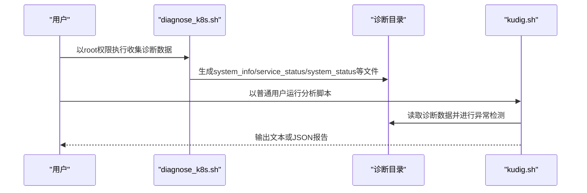
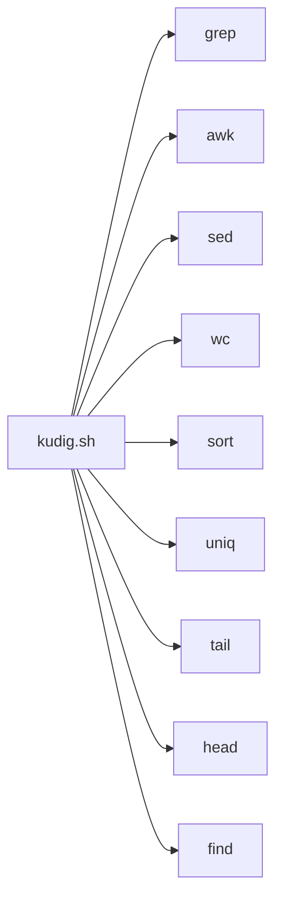

# 安装与配置

<cite>
**本文引用的文件**
- [README.md](file://README.md)
- [kudig.sh](file://kudig.sh)
- [diagnose_k8s.sh](file://reference/diagnose_k8s/diagnose_k8s.sh)
- [TESTING.md](file://TESTING.md)
</cite>

## 目录
1. [简介](#简介)
2. [项目结构](#项目结构)
3. [核心组件](#核心组件)
4. [架构总览](#架构总览)
5. [详细组件分析](#详细组件分析)
6. [依赖关系分析](#依赖关系分析)
7. [性能考虑](#性能考虑)
8. [故障排查指南](#故障排查指南)
9. [结论](#结论)
10. [附录](#附录)

## 简介
本章节面向首次接触 kudig.sh 的用户，提供从安装到配置的完整说明。重点覆盖以下方面：
- 如何通过 chmod +x kudig.sh 赋予脚本执行权限，以及该操作在 Linux 文件系统权限模型中的作用
- 系统要求：支持的操作系统（Red Hat、CentOS、Aliyun Linux、Kylin 等）、Bash 版本（4.0+）、必需命令（grep、awk、sed、wc、sort、uniq、tail、head、find）及其用途
- 权限要求：脚本本身以只读方式运行，无需 root；但其分析的诊断数据应由 diagnose_k8s.sh 以 root 权限收集
- 配置选项：命令行参数（--json、--verbose、-o）如何定制行为
- 常见问题与最佳实践：缺失依赖的安装命令、错误信息与解决方案、将脚本放入 PATH 便于全局调用

## 项目结构
仓库包含主工具脚本、参考的诊断数据收集脚本以及文档说明。下图展示了与安装和配置相关的核心文件与职责：

图表来源
- [kudig.sh](file://kudig.sh#L1-L120)
- [diagnose_k8s.sh](file://reference/diagnose_k8s/diagnose_k8s.sh#L1-L120)
- [README.md](file://README.md#L231-L266)

章节来源
- [README.md](file://README.md#L1-L120)
- [kudig.sh](file://kudig.sh#L1-L120)
- [diagnose_k8s.sh](file://reference/diagnose_k8s/diagnose_k8s.sh#L1-L120)

## 核心组件
- kudig.sh：负责解析 diagnose_k8s.sh 生成的诊断目录，进行异常检测与报告输出（文本/JSON），支持详细模式与文件输出
- diagnose_k8s.sh：负责以 root 权限收集节点诊断数据，生成包含 system_info、service_status、system_status、daemon_status 等文件的诊断目录
- README.md：提供安装、使用、系统要求与工作流程说明
- TESTING.md：提供测试流程与退出码约定，便于验证安装与配置正确性

章节来源
- [README.md](file://README.md#L231-L266)
- [kudig.sh](file://kudig.sh#L1-L120)
- [diagnose_k8s.sh](file://reference/diagnose_k8s/diagnose_k8s.sh#L1-L120)
- [TESTING.md](file://TESTING.md#L1-L80)

## 架构总览
kudig.sh 与 diagnose_k8s.sh 的协作流程如下：

图表来源
- [diagnose_k8s.sh](file://reference/diagnose_k8s/diagnose_k8s.sh#L1-L120)
- [kudig.sh](file://kudig.sh#L120-L220)
- [README.md](file://README.md#L238-L266)

## 详细组件分析

### 安装步骤与 chmod +x 的作用
- 步骤要点
  - 下载脚本到本地后，使用 chmod +x kudig.sh 为其添加执行权限
  - 之后即可直接 ./kudig.sh <诊断目录> 运行
- Linux 文件系统权限模型中的作用
  - 执行权限位（x）决定文件是否可作为程序被执行
  - 若无执行权限，即使脚本头部有 shebang（#!/usr/bin/env bash），仍会提示“Permission denied”
  - 建议将脚本放置在 PATH 中的可执行目录，便于全局调用

章节来源
- [README.md](file://README.md#L16-L23)
- [TESTING.md](file://TESTING.md#L18-L33)

### 系统要求与依赖命令
- 操作系统支持
  - Red Hat、CentOS、Aliyun Linux、Kylin 等主流 Linux 发行版
- Shell 版本
  - bash 4.0+
- 必需命令与用途
  - grep：在文本中检索模式（如服务状态、内核日志关键字）
  - awk：字段分割与数值计算（如负载解析、磁盘使用率处理）
  - sed：文本替换与清洗（在部分解析逻辑中使用）
  - wc：统计行数（安全读取与计数）
  - sort/uniq：排序与去重（如进程线程数统计）
  - tail/head：截取日志尾部/前若干行（如负载与连接跟踪）
  - find：定位/遍历进程/任务状态文件（辅助诊断）
- 依赖检查机制
  - 启动时会检查上述命令是否可用，缺失则报错并退出

章节来源
- [README.md](file://README.md#L231-L236)
- [kudig.sh](file://kudig.sh#L116-L139)

### 权限要求与数据来源
- 脚本权限
  - kudig.sh 以只读方式运行，无需 root 权限
- 数据收集权限
  - 诊断数据由 diagnose_k8s.sh 收集，需以 root 权限执行，确保能读取系统敏感信息与服务状态
- 数据完整性
  - 诊断目录需由 diagnose_k8s.sh 生成，否则可能出现关键文件缺失，脚本会发出警告但仍继续分析

章节来源
- [README.md](file://README.md#L311-L337)
- [diagnose_k8s.sh](file://reference/diagnose_k8s/diagnose_k8s.sh#L1-L40)
- [kudig.sh](file://kudig.sh#L141-L168)

### 配置选项与命令行参数
- 常用参数
  - --help/-h：显示帮助信息
  - --version/-v：显示版本信息
  - --verbose：详细模式，输出调试信息
  - --json：输出 JSON 格式报告
  - -o/--output <文件>：将报告保存到指定文件
- 行为说明
  - 仅允许指定一个诊断目录
  - 未指定目录时会提示并退出
  - 详细模式仅在需要排障时开启

章节来源
- [README.md](file://README.md#L37-L67)
- [kudig.sh](file://kudig.sh#L217-L258)

### 不同发行版安装缺失依赖的命令
- CentOS/RHEL
  - yum install -y grep gawk sed coreutils findutils
- Ubuntu/Debian
  - apt-get install -y grep gawk sed coreutils findutils

章节来源
- [README.md](file://README.md#L313-L322)

### 常见配置问题与解决方案
- 问题：提示命令不存在
  - 现象：启动时报错，提示缺少 grep、awk、sed 等命令
  - 解决：根据发行版安装对应包
- 问题：诊断目录结构不完整
  - 现象：警告信息“诊断目录结构可能不完整”
  - 解决：确保使用完整的 diagnose_k8s.sh 收集数据，并以 root 权限执行
- 问题：无法读取某些日志文件
  - 现象：某些检测项没有结果
  - 解决：确认诊断数据收集时具备足够权限，检查日志文件是否存在于诊断目录中

章节来源
- [README.md](file://README.md#L311-L337)

### 最佳实践
- 将脚本放置在系统 PATH 目录中（如 /usr/local/bin），以便全局调用
- 使用 --json 结合外部工具（如 jq、curl）进行自动化集成
- 在 CI/CD 或巡检脚本中，依据退出码（0/1/2）进行告警与处理

章节来源
- [README.md](file://README.md#L296-L310)
- [TESTING.md](file://TESTING.md#L133-L175)

## 依赖关系分析
kudig.sh 对系统命令的依赖关系如下：

图表来源
- [kudig.sh](file://kudig.sh#L116-L139)

章节来源
- [kudig.sh](file://kudig.sh#L116-L139)

## 性能考虑
- 仅本地分析，避免网络依赖，整体开销较低
- 大型日志文件建议使用 tail/head 截断，减少 IO 压力
- 详细模式会输出调试信息，仅在排障时启用

## 故障排查指南
- 依赖缺失
  - 现象：启动即退出并提示缺少命令
  - 处理：安装对应包后重试
- 诊断目录不完整
  - 现象：出现警告但仍继续分析
  - 处理：使用 root 重新执行 diagnose_k8s.sh 并确保收集完整
- 权限不足
  - 现象：无法读取某些文件
  - 处理：确认诊断数据收集时具备 root 权限
- 退出码含义
  - 0：未检测到异常
  - 1：检测到警告或提示级别异常
  - 2：检测到严重级别异常

章节来源
- [README.md](file://README.md#L223-L230)
- [TESTING.md](file://TESTING.md#L35-L42)

## 结论
kudig.sh 通过简洁的安装与配置流程，实现了对 Kubernetes 节点诊断数据的本地化分析。遵循本文档的安装步骤、系统要求与权限规范，即可在不同 Linux 发行版上稳定运行。配合 diagnose_k8s.sh 的 root 权限数据收集，可形成从采集到分析的完整闭环。

## 附录
- 术语
  - 诊断目录：由 diagnose_k8s.sh 生成的包含系统信息、服务状态、日志等文件的目录
- 参考
  - README.md：安装、使用与系统要求
  - TESTING.md：测试流程与退出码约定