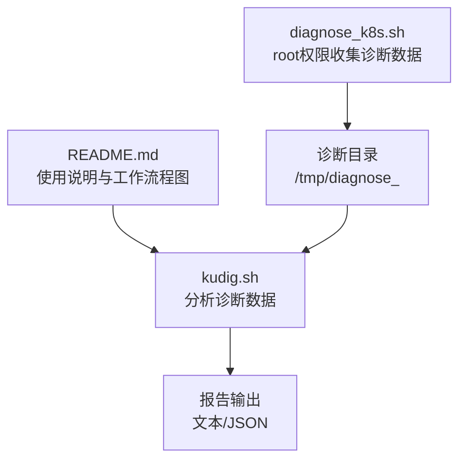
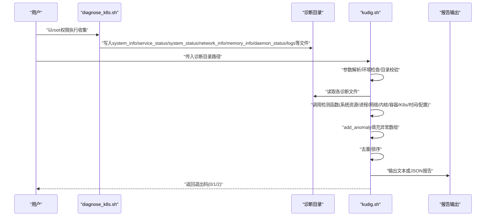
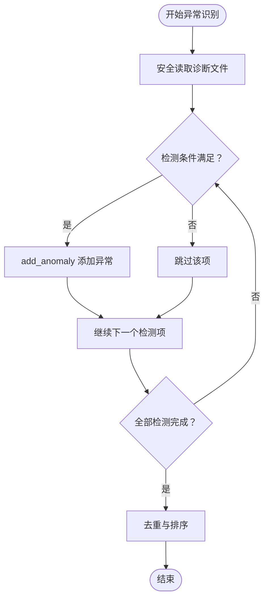
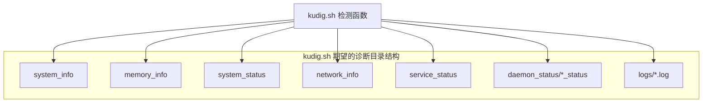

# 工作流程

<cite>
**本文引用的文件**
- [README.md](file://README.md)
- [kudig.sh](file://kudig.sh)
- [diagnose_k8s.sh](file://reference/diagnose_k8s/diagnose_k8s.sh)
- [TESTING.md](file://TESTING.md)
</cite>

## 目录
1. [简介](#简介)
2. [项目结构](#项目结构)
3. [核心组件](#核心组件)
4. [架构总览](#架构总览)
5. [详细组件分析](#详细组件分析)
6. [依赖关系分析](#依赖关系分析)
7. [性能考量](#性能考量)
8. [故障排查指南](#故障排查指南)
9. [结论](#结论)
10. [附录](#附录)

## 简介
本文件围绕 kudig.sh 的工作流程，系统性阐述从“数据收集”到“报告生成”的完整过程。重点包括：
- 数据收集阶段：由 reference/diagnose_k8s/diagnose_k8s.sh 以 root 权限采集系统、服务、网络、日志等诊断数据，并生成结构化的诊断目录。
- 数据分析阶段：kudig.sh 对诊断目录进行校验，调用一系列检测函数（如 check_system_resources、check_kernel 等）扫描并分析收集到的数据文件。
- 异常识别阶段：检测函数通过 add_anomaly 将发现的异常加入全局数组，脚本对部分缺失文件采取容错策略。
- 报告生成阶段：对异常进行去重、排序，并按用户选择输出文本或 JSON 格式的最终报告。

该流程强调非侵入性：kudig.sh 仅读取数据，不修改任何系统状态。

## 项目结构
仓库包含三个关键文件：
- README.md：项目说明、使用方法、工作流程图、异常规则与退出码说明。
- kudig.sh：诊断分析脚本，负责参数解析、数据校验、异常检测、报告生成与退出码控制。
- diagnose_k8s.sh：诊断数据收集脚本，负责以 root 权限采集系统、服务、网络、日志等信息并写入诊断目录。
- TESTING.md：测试说明与预期输出示例，补充了工作流程的实操参考。

图表来源
- [README.md](file://README.md#L237-L266)
- [kudig.sh](file://kudig.sh#L1266-L1312)
- [diagnose_k8s.sh](file://reference/diagnose_k8s/diagnose_k8s.sh#L1-L60)

章节来源
- [README.md](file://README.md#L237-L266)
- [kudig.sh](file://kudig.sh#L1266-L1312)
- [diagnose_k8s.sh](file://reference/diagnose_k8s/diagnose_k8s.sh#L1-L60)

## 核心组件
- 参数解析与环境检查：解析命令行参数、检查必要命令、校验诊断目录存在性与完整性。
- 数据解析辅助函数：从 system_info、system_status、memory_info、network_info、daemon_status、logs 等文件中提取所需字段。
- 异常检测器：覆盖系统资源、进程与服务、网络、内核、容器运行时、Kubernetes 组件、时间同步、配置等八大类。
- 异常管理：add_anomaly 将异常封装为“严重级别|中文名|英文标识|详情|位置”，并提供去重与排序。
- 报告生成：按文本或 JSON 格式输出，包含时间戳、主机名、诊断目录、异常列表与统计摘要。
- 退出码：0 表示无异常，1 表示存在警告/提示，2 表示存在严重异常。

章节来源
- [kudig.sh](file://kudig.sh#L116-L200)
- [kudig.sh](file://kudig.sh#L213-L259)
- [kudig.sh](file://kudig.sh#L260-L394)
- [kudig.sh](file://kudig.sh#L414-L797)
- [kudig.sh](file://kudig.sh#L800-L957)
- [kudig.sh](file://kudig.sh#L958-L1041)
- [kudig.sh](file://kudig.sh#L1043-L1180)
- [kudig.sh](file://kudig.sh#L1181-L1264)
- [kudig.sh](file://kudig.sh#L1266-L1312)

## 架构总览
下图基于 README.md 的流程图，映射到实际脚本调用关系与数据流向。

图表来源
- [README.md](file://README.md#L237-L266)
- [kudig.sh](file://kudig.sh#L1266-L1312)
- [diagnose_k8s.sh](file://reference/diagnose_k8s/diagnose_k8s.sh#L1-L60)

## 详细组件分析

### 数据收集阶段：diagnose_k8s.sh
- 权限要求：以 root 用户执行，确保能读取系统敏感信息与日志。
- 诊断目录结构：创建 /tmp/diagnose_<timestamp>，并在其中生成 system_info、service_status、system_status、network_info、memory_info、daemon_status、logs 等文件与子目录。
- 关键采集内容：
  - 系统信息：内核版本、发行版、ulimit、sysctl、vmstat 等。
  - 服务状态：ntpd、chronyd、kubelet、edge-hub、firewalld、docker/containerd 等。
  - 网络信息：接口、链路、路由、iptables 规则、连接跟踪、netstat 输出。
  - 内存信息：/proc/meminfo 及相关统计。
  - 系统状态：uptime、top、ps、netstat、sar、df、mounts、rpm、dbus introspect、lsof、文件句柄统计、PID 泄漏检测、runc 堆栈等。
  - 守护进程状态：systemctl status 输出，分别写入 daemon_status/<name>_status。
  - 日志：dmesg、messages、journalctl（kubelet、edge-hub、docker/containerd），并复制容器运行时日志与配置。
- 非侵入性：仅写入诊断目录，不修改系统配置或日志文件。

章节来源
- [diagnose_k8s.sh](file://reference/diagnose_k8s/diagnose_k8s.sh#L1-L60)
- [diagnose_k8s.sh](file://reference/diagnose_k8s/diagnose_k8s.sh#L71-L110)
- [diagnose_k8s.sh](file://reference/diagnose_k8s/diagnose_k8s.sh#L138-L184)
- [diagnose_k8s.sh](file://reference/diagnose_k8s/diagnose_k8s.sh#L197-L203)
- [diagnose_k8s.sh](file://reference/diagnose_k8s/diagnose_k8s.sh#L241-L257)

### 数据分析阶段：kudig.sh
- 参数解析与环境检查：支持 --help、--version、--verbose、--json、-o/--output 等选项；检查必要命令是否存在。
- 目录校验：验证诊断目录存在；对关键文件（如 system_info、service_status、system_status）进行宽松检查，若缺失则发出警告但仍继续分析。
- 数据解析辅助函数：
  - 从 system_info 提取 CPU 核心数、总内存、ulimit、sysctl 等。
  - 从 system_status 提取负载、df、mounts、rpm、lsof、文件句柄统计、PID 泄漏检测、runc 堆栈等。
  - 从 network_info 提取接口状态、路由、iptables 规则、连接跟踪等。
  - 从 daemon_status/<name>_status 提取服务状态（running/failed/stopped/unknown）。
  - 从 logs/<name>.log 统计错误模式出现次数或匹配关键字。
- 异常检测器（节选）：
  - 系统资源：负载、内存、磁盘、文件句柄、PID 泄漏、inode 使用率。
  - 进程与服务：kubelet、容器运行时、ps 命令挂起、D 状态进程、runc 挂起、firewalld 运行。
  - 网络：连接跟踪表使用率、网卡 down、默认路由缺失、kubelet 端口未监听、iptables 规则过多。
  - 内核：内核 panic、OOM Killer、系统内存不足、只读文件系统、IO 错误、内核模块加载失败、NMI watchdog。
  - 容器运行时：Docker 启动失败、存储驱动错误、容器创建失败率高、镜像拉取失败。
  - Kubernetes 组件：PLEG 不健康、CNI 插件错误、证书过期/即将过期、API Server 连接失败、Kubelet 认证失败、Pod 驱逐、节点 NotReady、磁盘/内存压力。
  - 时间同步：ntpd/chronyd 未运行。
  - 配置：swap 未禁用、IP 转发未启用、bridge-nf-call-iptables 未启用、ulimit 过低、SELinux Enforcing。

章节来源
- [kudig.sh](file://kudig.sh#L116-L200)
- [kudig.sh](file://kudig.sh#L141-L168)
- [kudig.sh](file://kudig.sh#L260-L394)
- [kudig.sh](file://kudig.sh#L414-L797)
- [kudig.sh](file://kudig.sh#L800-L957)
- [kudig.sh](file://kudig.sh#L958-L1041)

### 异常识别阶段：add_anomaly 与容错策略
- add_anomaly：将异常封装为“严重级别|中文名称|英文标识|详情|位置”，统一加入全局数组。
- 容错策略：
  - safe_cat/safe_line_count/extract_number：当文件不存在时返回空或 0，避免中断。
  - validate_diagnose_dir：对关键文件进行宽松检查，缺失时仅发出警告并继续分析。
  - pattern_exists/count_pattern_in_log：对缺失日志文件返回 0，不影响整体流程。
- 异常去重与排序：
  - 去重：以英文标识符为键，避免重复异常。
  - 排序：先严重，再警告，后提示，便于优先处理。

图表来源
- [kudig.sh](file://kudig.sh#L170-L189)
- [kudig.sh](file://kudig.sh#L1043-L1090)

章节来源
- [kudig.sh](file://kudig.sh#L170-L189)
- [kudig.sh](file://kudig.sh#L1043-L1090)

### 报告生成阶段：去重、排序与格式化输出
- 去重与排序：按英文标识符去重，按严重级别排序。
- 文本输出：包含标题、时间、主机名、诊断目录、分级别异常列表与统计。
- JSON 输出：包含版本、时间戳、主机名、诊断目录、异常数组与统计摘要。
- 文件保存：支持 -o/--output 将报告写入文件。
- 退出码：0/1/2，分别对应无异常、存在警告/提示、存在严重异常。

章节来源
- [kudig.sh](file://kudig.sh#L1043-L1180)
- [kudig.sh](file://kudig.sh#L1181-L1264)
- [kudig.sh](file://kudig.sh#L1266-L1312)
- [README.md](file://README.md#L223-L236)

## 依赖关系分析
- 外部命令依赖：grep、awk、sed、wc、sort、uniq、tail、head、find。
- 诊断目录契约（kudig.sh 期望的文件结构）：
  - system_info：系统基础信息（CPU、内存、ulimit、sysctl、vmstat 等）。
  - memory_info：内存相关信息。
  - system_status：系统运行状态（负载、df、rpm、lsof、文件句柄统计、PID 泄漏检测、runc 堆栈等）。
  - network_info：网络相关信息（接口、路由、iptables、连接跟踪、netstat 等）。
  - service_status：服务状态（ntpd、chronyd、kubelet、edge-hub、firewalld、docker/containerd 等）。
  - daemon_status/<name>_status：各守护进程状态。
  - logs/<name>.log：日志文件（dmesg、messages、kubelet、edge-hub、docker/containerd 等）。
- 数据契约映射：
  - kudig.sh 通过 safe_cat/safe_line_count/extract_number 等安全函数读取上述文件。
  - 检测函数直接依赖对应文件的存在性与内容格式，缺失时返回 0 或空，保证流程不中断。

图表来源
- [kudig.sh](file://kudig.sh#L260-L394)
- [kudig.sh](file://kudig.sh#L414-L797)
- [kudig.sh](file://kudig.sh#L800-L957)
- [kudig.sh](file://kudig.sh#L958-L1041)

章节来源
- [kudig.sh](file://kudig.sh#L260-L394)
- [kudig.sh](file://kudig.sh#L414-L797)
- [kudig.sh](file://kudig.sh#L800-L957)
- [kudig.sh](file://kudig.sh#L958-L1041)

## 性能考量
- I/O 开销：读取大量 /proc 文件与日志文件，建议在磁盘 IO 空闲时段执行。
- 正则匹配：grep/awk/sed 的使用较为频繁，建议在大体量日志场景下关注正则复杂度。
- 并发与超时：diagnose_k8s.sh 对部分命令设置了超时，避免阻塞；kudig.sh 通过安全函数与宽松校验提升鲁棒性。
- 去重与排序：ANOMALIES 数组规模通常较小，去重与排序开销可忽略。

## 故障排查指南
- 常见问题与解决：
  - 命令缺失：安装缺失的命令（grep、awk、sed、wc、sort、uniq、tail、head、find）。
  - 诊断目录结构不完整：确保使用完整的 diagnose_k8s.sh 收集数据，并以 root 权限执行。
  - 无法读取某些日志文件：确认诊断数据收集时具备足够权限，检查日志文件是否存在于诊断目录中。
- 退出码含义：
  - 0：未检测到异常。
  - 1：存在警告或提示级别异常。
  - 2：存在严重级别异常。
- 测试建议：
  - 使用 TESTING.md 中的步骤准备诊断数据并运行 kudig.sh，验证帮助、版本、JSON 输出、文件保存与退出码。

章节来源
- [README.md](file://README.md#L311-L337)
- [README.md](file://README.md#L223-L236)
- [TESTING.md](file://TESTING.md#L1-L68)
- [TESTING.md](file://TESTING.md#L177-L197)

## 结论
kudig.sh 与 diagnose_k8s.sh 形成完整的“采集—分析—报告”闭环。前者以非侵入方式读取后者生成的诊断目录，通过多维检测规则识别异常，并以文本或 JSON 格式输出，辅以去重与排序，帮助运维人员快速定位问题。该流程可无缝集成到标准操作程序（SOP）中，作为日常巡检与故障排查的自动化工具链。

## 附录
- 实际使用场景与集成建议：
  - 快速诊断：先以 root 权限执行 diagnose_k8s.sh，再以普通用户运行 kudig.sh 分析报告。
  - 自动化巡检：定期收集最新诊断目录并生成 JSON 报告，结合监控系统告警策略。
  - 与监控系统集成：将 JSON 报告通过 HTTP POST 发送到监控平台，实现自动化归档与告警。

章节来源
- [README.md](file://README.md#L268-L310)
- [TESTING.md](file://TESTING.md#L132-L175)