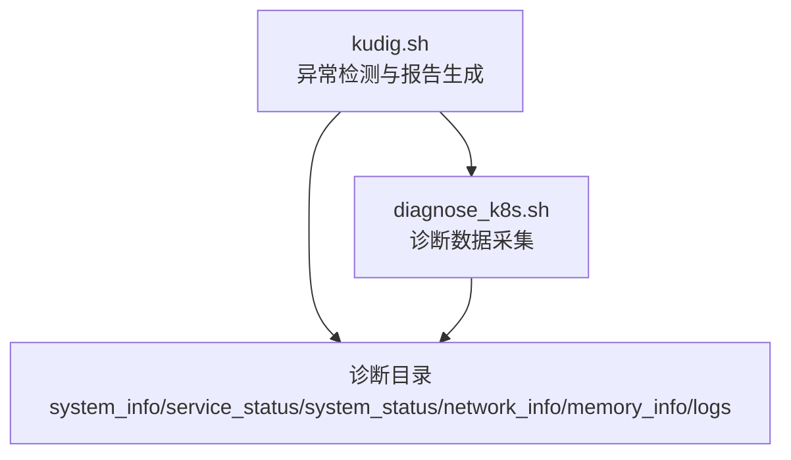
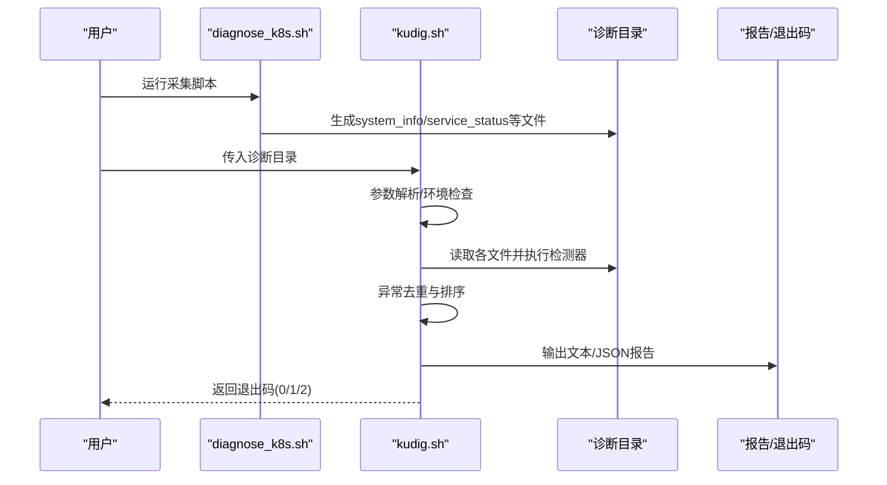
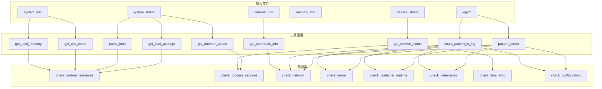

# 异常检测规则

<cite>
**本文引用的文件**
- [README.md](file://README.md)
- [kudig.sh](file://kudig.sh)
- [reference/diagnose_k8s/diagnose_k8s.sh](file://reference/diagnose_k8s/diagnose_k8s.sh)
- [TESTING.md](file://TESTING.md)
</cite>

## 目录
1. [简介](#简介)
2. [项目结构](#项目结构)
3. [核心组件](#核心组件)
4. [架构总览](#架构总览)
5. [详细组件分析](#详细组件分析)
6. [依赖关系分析](#依赖关系分析)
7. [性能考量](#性能考量)
8. [故障排查指南](#故障排查指南)
9. [结论](#结论)
10. [附录：规则参考表](#附录规则参考表)

## 简介
本文件系统性梳理 kudig.sh 的异常检测规则，覆盖系统资源、进程与服务、网络、内核与驱动、容器运行时、Kubernetes 组件、配置等八大类。针对每条规则，说明其检测逻辑、触发条件、严重级别以及在源码中的实现位置（如 check_system_resources 函数中的 awk 计算、get_load_average 和 parse_load 的负载提取、pattern_exists 对日志模式的匹配等），并给出设计原则与扩展建议，帮助读者快速理解与使用该工具。

## 项目结构
kudig.sh 采用“单一脚本 + 诊断采集脚本”的协作模式：
- kudig.sh：负责解析诊断目录、执行各类检测器、生成报告与退出码。
- diagnose_k8s.sh：负责采集系统信息、服务状态、日志与网络等诊断数据，形成标准目录结构供 kudig.sh 分析。

图表来源
- [kudig.sh](file://kudig.sh#L1266-L1312)
- [reference/diagnose_k8s/diagnose_k8s.sh](file://reference/diagnose_k8s/diagnose_k8s.sh#L1-L120)

章节来源
- [README.md](file://README.md#L231-L266)
- [reference/diagnose_k8s/diagnose_k8s.sh](file://reference/diagnose_k8s/diagnose_k8s.sh#L1-L120)

## 核心组件
- 工具函数层：命令检查、安全读取、数值提取、日志模式匹配、连接跟踪表解析等。
- 检测器层：系统资源、进程与服务、网络、内核与驱动、容器运行时、Kubernetes 组件、时间同步、配置等八类检测器。
- 报告与退出码：异常去重、排序、文本/JSON 输出、按严重级别返回退出码。

章节来源
- [kudig.sh](file://kudig.sh#L117-L200)
- [kudig.sh](file://kudig.sh#L414-L1041)
- [kudig.sh](file://kudig.sh#L1043-L1312)

## 架构总览
整体工作流：采集 -> 解析 -> 检测 -> 报告 -> 退出码。

图表来源
- [reference/diagnose_k8s/diagnose_k8s.sh](file://reference/diagnose_k8s/diagnose_k8s.sh#L455-L506)
- [kudig.sh](file://kudig.sh#L1266-L1312)

## 详细组件分析

### 系统资源类
- 规则1：系统负载过高（HIGH_SYSTEM_LOAD）
  - 检测逻辑：从 system_status 提取 15 分钟负载，与 CPU 核心数×4 比较；若超阈值则判定为严重。
  - 触发条件：15 分钟负载 > CPU 核心数 × 4。
  - 严重级别：严重。
  - 实现位置：check_system_resources 中 get_load_average 与 parse_load 提取负载，awk 计算阈值并比较。
  - 设计原则：基于 Kubernetes 最佳实践，避免长时间高负载导致调度与节点稳定性问题。

- 规则2：系统负载偏高（ELEVATED_SYSTEM_LOAD）
  - 检测逻辑：15 分钟负载 > CPU 核心数 × 2。
  - 触发条件：满足上述不等式。
  - 严重级别：警告。
  - 实现位置：同上，阈值不同。

- 规则3：内存使用率过高（HIGH_MEMORY_USAGE）
  - 检测逻辑：从 memory_info 计算 MemTotal 与 MemAvailable，得出使用率 ≥ 95%。
  - 触发条件：使用率 ≥ 95%。
  - 严重级别：严重。
  - 实现位置：check_system_resources 中对 memory_info 的解析与计算。

- 规则4：内存使用率偏高（ELEVATED_MEMORY_USAGE）
  - 检测逻辑：使用率 ≥ 85%。
  - 触发条件：满足上述不等式。
  - 严重级别：警告。
  - 实现位置：同上。

- 规则5：磁盘空间严重不足（DISK_SPACE_CRITICAL）
  - 检测逻辑：从 system_status 的 df -h 输出中筛选使用率 ≥ 95% 的挂载点。
  - 触发条件：存在 ≥ 95% 的挂载点。
  - 严重级别：严重。
  - 实现位置：check_disk_usage 与 check_system_resources 的组合。

- 规则6：磁盘空间不足（DISK_SPACE_LOW）
  - 检测逻辑：使用率 ≥ 90%。
  - 触发条件：满足上述不等式。
  - 严重级别：警告。
  - 实现位置：同上。

- 规则7：文件句柄使用量过高（HIGH_FILE_HANDLES）
  - 检测逻辑：从 system_status 中查找文件句柄数最大的进程，若 > 50000 判定为警告。
  - 触发条件：最大句柄数 > 50000。
  - 严重级别：警告。
  - 实现位置：check_system_resources 中对 system_status 的解析。

- 规则8：进程/线程数异常（PID_LEAK_DETECTED）
  - 检测逻辑：从 system_status 的 PID 泄漏检测区间提取最大线程数，> 10000 判定为严重。
  - 触发条件：最大线程数 > 10000。
  - 严重级别：严重。
  - 实现位置：check_system_resources 中对 system_status 的解析。

- 规则9：Inode 使用率过高（HIGH_INODE_USAGE）
  - 检测逻辑：从 system_status 的 df -i 输出中筛选 inode 使用率 ≥ 90% 的挂载点。
  - 触发条件：存在 ≥ 90% 的 inode 使用率。
  - 严重级别：警告。
  - 实现位置：check_system_resources 中对 inode 使用率的解析。

章节来源
- [kudig.sh](file://kudig.sh#L417-L549)
- [kudig.sh](file://kudig.sh#L290-L307)
- [kudig.sh](file://kudig.sh#L308-L319)

### 进程与服务类
- 规则10：Kubelet 服务未运行（KUBELET_SERVICE_DOWN）
  - 检测逻辑：从 daemon_status/kubelet_status 中解析 systemctl 状态，若 failed 判定为严重。
  - 触发条件：状态为 failed。
  - 严重级别：严重。
  - 实现位置：check_process_services 中 get_daemon_status 与分支判断。

- 规则11：容器运行时服务异常（CONTAINER_RUNTIME_DOWN）
  - 检测逻辑：docker 与 containerd 均为 failed。
  - 触发条件：两者状态均为 failed。
  - 严重级别：严重。
  - 实现位置：check_process_services 中对 docker 与 containerd 的状态判断。

- 规则12：ps 命令挂起（PS_COMMAND_HUNG）
  - 检测逻辑：诊断目录包含 ps_command_status，且其中包含“ps -ef command is hung”。
  - 触发条件：pattern_exists 匹配成功。
  - 严重级别：严重。
  - 实现位置：check_process_services 中 pattern_exists 的使用。

- 规则13：存在 D 状态进程（PROCESS_IN_D_STATE）
  - 检测逻辑：统计 ps_command_status 中“is in State D”的行数。
  - 触发条件：计数 > 0。
  - 严重级别：严重。
  - 实现位置：check_process_services 中 grep 计数与 add_anomaly 调用。

- 规则14：runc 进程可能挂起（RUNC_PROCESS_HANG）
  - 检测逻辑：从 system_status 中匹配“runc process.*maybe hang”，并统计次数。
  - 触发条件：计数 > 0。
  - 严重级别：警告。
  - 实现位置：check_process_services 中 pattern_exists 与 grep 计数。

- 规则15：Firewalld 服务运行中（FIREWALLD_RUNNING）
  - 检测逻辑：从 service_status 中匹配 firewalld.*running。
  - 触发条件：匹配成功。
  - 严重级别：警告。
  - 实现位置：check_process_services 中 pattern_exists 的使用。

章节来源
- [kudig.sh](file://kudig.sh#L551-L634)
- [reference/diagnose_k8s/diagnose_k8s.sh](file://reference/diagnose_k8s/diagnose_k8s.sh#L109-L135)

### 网络类
- 规则16：连接跟踪表满（CONNTRACK_TABLE_FULL）
  - 检测逻辑：从 network_info 统计 ipv4 表项数为当前连接数，从 system_info 获取 nf_conntrack_max 为上限，计算使用率 ≥ 95%。
  - 触发条件：使用率 ≥ 95%。
  - 严重级别：严重。
  - 实现位置：check_network 中 get_conntrack_info 与使用率计算。

- 规则17：连接跟踪表使用率高（CONNTRACK_TABLE_HIGH_USAGE）
  - 检测逻辑：使用率 ≥ 80%。
  - 触发条件：满足上述不等式。
  - 严重级别：警告。
  - 实现位置：同上。

- 规则18：网卡接口 down（NETWORK_INTERFACE_DOWN）
  - 检测逻辑：从 network_info 中查找 state DOWN 的接口（排除 lo 与 veth）。
  - 触发条件：存在 DOWN 接口。
  - 严重级别：警告。
  - 实现位置：check_network 中对 network_info 的解析。

- 规则19：缺少默认路由（NO_DEFAULT_ROUTE）
  - 检测逻辑：从 network_info 中检查是否存在 default via。
  - 触发条件：不存在。
  - 严重级别：警告。
  - 实现位置：check_network 中 pattern_exists 的使用。

- 规则20：Kubelet 端口未监听（KUBELET_PORT_NOT_LISTENING）
  - 检测逻辑：从 system_status 中检查 :10250.*LISTEN。
  - 触发条件：不存在监听。
  - 严重级别：严重。
  - 实现位置：check_network 中 pattern_exists 的使用。

- 规则21：iptables 规则过多（TOO_MANY_IPTABLES_RULES）
  - 检测逻辑：统计 network_info 中以 -A 开头的行数，> 50000。
  - 触发条件：规则数 > 50000。
  - 严重级别：警告。
  - 实现位置：check_network 中 grep 计数。

章节来源
- [kudig.sh](file://kudig.sh#L636-L715)
- [kudig.sh](file://kudig.sh#L395-L411)

### 内核与驱动类
- 规则22：内核 Panic（KERNEL_PANIC）
  - 检测逻辑：从 logs/dmesg.log 中匹配 Kernel panic。
  - 触发条件：匹配成功。
  - 严重级别：严重。
  - 实现位置：check_kernel 中 pattern_exists 的使用。

- 规则23：内核触发 OOM 杀进程（KERNEL_OOM_KILLER）
  - 检测逻辑：统计 dmesg.log 中 Out of memory: Kill process 的次数。
  - 触发条件：次数 > 0。
  - 严重级别：严重。
  - 实现位置：check_kernel 中 count_pattern_in_log 的使用。

- 规则24：系统内存不足（SYSTEM_OUT_OF_MEMORY）
  - 检测逻辑：从 logs/messages 中匹配 Out of memory 的次数。
  - 触发条件：次数 > 0。
  - 严重级别：严重。
  - 实现位置：check_kernel 中 count_pattern_in_log 的使用。

- 规则25：文件系统只读（FILESYSTEM_READONLY）
  - 检测逻辑：从 logs/dmesg.log 中匹配 Read-only file system。
  - 触发条件：匹配成功。
  - 严重级别：严重。
  - 实现位置：check_kernel 中 pattern_exists 的使用。

- 规则26：磁盘 IO 错误（DISK_IO_ERROR）
  - 检测逻辑：统计 dmesg.log 中 I/O error 的次数，> 10。
  - 触发条件：次数 > 10。
  - 严重级别：严重。
  - 实现位置：check_kernel 中 count_pattern_in_log 的使用。

- 规则27：内核模块加载失败（KERNEL_MODULE_LOAD_FAILED）
  - 检测逻辑：从 logs/dmesg.log 中匹配 module.*failed。
  - 触发条件：匹配成功。
  - 严重级别：警告。
  - 实现位置：check_kernel 中 pattern_exists 的使用。

- 规则28：NMI Watchdog 触发（NMI_WATCHDOG_TRIGGERED）
  - 检测逻辑：从 logs/dmesg.log 中匹配 NMI watchdog。
  - 触发条件：匹配成功。
  - 严重级别：警告。
  - 实现位置：check_kernel 中 pattern_exists 的使用。

章节来源
- [kudig.sh](file://kudig.sh#L717-L797)
- [reference/diagnose_k8s/diagnose_k8s.sh](file://reference/diagnose_k8s/diagnose_k8s.sh#L241-L257)

### 容器运行时类
- 规则29：Docker 启动失败（DOCKER_START_FAILED）
  - 检测逻辑：从 logs/docker.log 中匹配 Failed to start。
  - 触发条件：匹配成功。
  - 严重级别：严重。
  - 实现位置：check_container_runtime 中 pattern_exists 的使用。

- 规则30：Docker 存储驱动错误（DOCKER_STORAGE_DRIVER_ERROR）
  - 检测逻辑：匹配 storage driver.*error。
  - 触发条件：匹配成功。
  - 严重级别：严重。
  - 实现位置：check_container_runtime 中 pattern_exists 的使用。

- 规则31：容器创建失败率高（CONTAINER_CREATE_FAILED）
  - 检测逻辑：统计 logs/containerd.log 中 failed to create 的次数，> 10。
  - 触发条件：次数 > 10。
  - 严重级别：警告。
  - 实现位置：check_container_runtime 中 count_pattern_in_log 的使用。

- 规则32：镜像拉取失败（IMAGE_PULL_FAILED）
  - 检测逻辑：统计 logs/kubelet.log 中 Failed to pull image 的次数，> 5。
  - 触发条件：次数 > 5。
  - 严重级别：警告。
  - 实现位置：check_container_runtime 中 count_pattern_in_log 的使用。

章节来源
- [kudig.sh](file://kudig.sh#L800-L854)

### Kubernetes 组件类
- 规则33：Kubelet PLEG 不健康（KUBELET_PLEG_UNHEALTHY）
  - 检测逻辑：从 logs/kubelet.log 中匹配 PLEG is not healthy 并统计次数。
  - 触发条件：次数 > 0。
  - 严重级别：严重。
  - 实现位置：check_kubernetes 中 pattern_exists 与 count_pattern_in_log 的使用。

- 规则34：CNI 网络插件错误（CNI_PLUGIN_ERROR）
  - 检测逻辑：匹配 Failed to create pod sandbox.*CNI 与 CNI.*failed。
  - 触发条件：匹配成功。
  - 严重级别：严重。
  - 实现位置：check_kubernetes 中 pattern_exists 的使用。

- 规则35：证书已过期（CERTIFICATE_EXPIRED）
  - 检测逻辑：匹配 certificate has expired。
  - 触发条件：匹配成功。
  - 严重级别：严重。
  - 实现位置：check_kubernetes 中 pattern_exists 的使用。

- 规则36：证书即将过期（CERTIFICATE_EXPIRING）
  - 检测逻辑：匹配 certificate will expire。
  - 触发条件：匹配成功。
  - 严重级别：警告。
  - 实现位置：check_kubernetes 中 pattern_exists 的使用。

- 规则37：API Server 连接失败（APISERVER_CONNECTION_FAILED）
  - 检测逻辑：统计 Unable to connect to the server 的次数，> 10。
  - 触发条件：次数 > 10。
  - 严重级别：严重。
  - 实现位置：check_kubernetes 中 count_pattern_in_log 的使用。

- 规则38：Kubelet 认证失败（KUBELET_AUTH_FAILED）
  - 检测逻辑：匹配 Unauthorized 并统计次数。
  - 触发条件：次数 > 0。
  - 严重级别：严重。
  - 实现位置：check_kubernetes 中 pattern_exists 与 count_pattern_in_log 的使用。

- 规则39：Pod 被驱逐（POD_EVICTED）
  - 检测逻辑：匹配 evicted pod 并统计次数。
  - 触发条件：次数 > 0。
  - 严重级别：警告。
  - 实现位置：check_kubernetes 中 pattern_exists 与 count_pattern_in_log 的使用。

- 规则40：节点 NotReady 状态（NODE_NOT_READY）
  - 检测逻辑：匹配 Node.*NotReady。
  - 触发条件：匹配成功。
  - 严重级别：严重。
  - 实现位置：check_kubernetes 中 pattern_exists 的使用。

- 规则41：磁盘压力（DISK_PRESSURE）
  - 检测逻辑：匹配 DiskPressure。
  - 触发条件：匹配成功。
  - 严重级别：警告。
  - 实现位置：check_kubernetes 中 pattern_exists 的使用。

- 规则42：内存压力（MEMORY_PRESSURE）
  - 检测逻辑：匹配 MemoryPressure。
  - 触发条件：匹配成功。
  - 严重级别：警告。
  - 实现位置：check_kubernetes 中 pattern_exists 的使用。

章节来源
- [kudig.sh](file://kudig.sh#L856-L957)

### 配置类
- 规则43：时间同步服务未运行（TIME_SYNC_SERVICE_DOWN）
  - 检测逻辑：从 service_status 中检查 ntpd 与 chronyd 的状态，若均非 running 判定为提示。
  - 触发条件：两者均非 running。
  - 严重级别：提示。
  - 实现位置：check_time_sync 中 get_service_status 的使用。

- 规则44：Swap 未禁用（SWAP_NOT_DISABLED）
  - 检测逻辑：从 system_info 中检查 SwapTotal 是否大于 0。
  - 触发条件：SwapTotal > 0。
  - 严重级别：提示。
  - 实现位置：check_configuration 中 pattern_exists 与数值提取。

- 规则45：IP 转发未启用（IP_FORWARD_DISABLED）
  - 检测逻辑：从 system_info 中检查 net.ipv4.ip_forward = 0。
  - 触发条件：等于 0。
  - 严重级别：警告。
  - 实现位置：check_configuration 中 pattern_exists 的使用。

- 规则46：bridge-nf-call-iptables 未启用（BRIDGE_NF_CALL_IPTABLES_DISABLED）
  - 检测逻辑：从 system_info 中检查 net.bridge.bridge-nf-call-iptables = 0。
  - 触发条件：等于 0。
  - 严重级别：警告。
  - 实现位置：check_configuration 中 pattern_exists 的使用。

- 规则47：文件句柄限制过低（LOW_ULIMIT_NOFILE）
  - 检测逻辑：从 system_info 中检查 open files 限制为 1024。
  - 触发条件：等于 1024。
  - 严重级别：提示。
  - 实现位置：check_configuration 中 pattern_exists 的使用。

- 规则48：SELinux 处于 Enforcing 模式（SELINUX_ENFORCING）
  - 检测逻辑：从 system_info 中检查 SELinux.*enforcing。
  - 触发条件：匹配成功。
  - 严重级别：提示。
  - 实现位置：check_configuration 中 pattern_exists 的使用。

章节来源
- [kudig.sh](file://kudig.sh#L959-L1041)

## 依赖关系分析
- 输入依赖：诊断目录下的 system_info、service_status、system_status、network_info、memory_info、logs/* 等文件。
- 关键函数依赖：
  - get_load_average / parse_load：系统负载提取与解析。
  - get_cpu_cores / get_total_memory：系统资源基数提取。
  - get_daemon_status / get_service_status：服务状态解析。
  - pattern_exists / count_pattern_in_log：日志模式匹配与计数。
  - get_conntrack_info：连接跟踪表解析。
- 控制流：主函数依次调用八类检测器，再进行去重、排序与输出。

图表来源
- [kudig.sh](file://kudig.sh#L264-L411)
- [kudig.sh](file://kudig.sh#L414-L1041)

章节来源
- [kudig.sh](file://kudig.sh#L1266-L1312)

## 性能考量
- I/O 与正则匹配：多处使用 grep/awk/sed，建议确保诊断数据规模可控；对大文件使用精确的范围限定（如 check_disk_usage 对 df 输出的范围界定）。
- 计算复杂度：大部分检测器为 O(n) 遍历，其中 count_pattern_in_log 为 O(n) 计数，总体可接受。
- 退出码策略：严重异常直接返回 2，有助于快速告警；建议在自动化巡检中结合阈值与频率控制，避免噪声。

## 故障排查指南
- 症状：诊断目录结构不完整
  - 现象：未找到关键文件，脚本发出警告但仍继续分析。
  - 处理：确保使用 diagnose_k8s.sh 完整采集数据，必要时以 root 权限执行。
  - 章节来源
    - [kudig.sh](file://kudig.sh#L141-L168)
    - [reference/diagnose_k8s/diagnose_k8s.sh](file://reference/diagnose_k8s/diagnose_k8s.sh#L455-L506)

- 症状：某些检测项无结果
  - 现象：对应日志文件缺失或为空。
  - 处理：确认 diagnose_k8s.sh 是否成功采集到目标文件；检查权限与路径。
  - 章节来源
    - [kudig.sh](file://kudig.sh#L183-L200)

- 症状：命令不存在
  - 现象：缺少 grep/awk/sed 等基础命令。
  - 处理：安装缺失命令后重试。
  - 章节来源
    - [kudig.sh](file://kudig.sh#L121-L139)

- 症状：退出码不符合预期
  - 现象：0/1/2 与期望不符。
  - 处理：检查报告中严重级别异常数量；确认阈值与触发条件。
  - 章节来源
    - [kudig.sh](file://kudig.sh#L1292-L1308)
    - [README.md](file://README.md#L223-L230)

## 结论
kudig.sh 通过八类检测器与统一的异常管理机制，实现了对 Kubernetes 节点的全面诊断。其规则设计遵循 Kubernetes 最佳实践与常见故障模式，具备良好的可读性与可扩展性。建议在生产环境中结合自动化巡检与告警策略，持续优化阈值与规则集。

## 附录：规则参考表
下表汇总所有异常标识符、中文名称、严重级别与简要说明，便于快速查阅。

- 系统资源类
  - HIGH_SYSTEM_LOAD：系统负载过高（严重）
  - ELEVATED_SYSTEM_LOAD：系统负载偏高（警告）
  - HIGH_MEMORY_USAGE：内存使用率过高（严重）
  - ELEVATED_MEMORY_USAGE：内存使用率偏高（警告）
  - DISK_SPACE_CRITICAL：磁盘空间严重不足（严重）
  - DISK_SPACE_LOW：磁盘空间不足（警告）
  - HIGH_FILE_HANDLES：文件句柄使用量过高（警告）
  - PID_LEAK_DETECTED：进程/线程数异常（严重）
  - HIGH_INODE_USAGE：Inode 使用率过高（警告）

- 进程与服务类
  - KUBELET_SERVICE_DOWN：Kubelet 服务未运行（严重）
  - CONTAINER_RUNTIME_DOWN：容器运行时服务异常（严重）
  - PS_COMMAND_HUNG：ps 命令挂起（严重）
  - PROCESS_IN_D_STATE：存在 D 状态进程（严重）
  - RUNC_PROCESS_HANG：runc 进程可能挂起（警告）
  - FIREWALLD_RUNNING：Firewalld 服务运行中（警告）

- 网络类
  - CONNTRACK_TABLE_FULL：连接跟踪表满（严重）
  - CONNTRACK_TABLE_HIGH_USAGE：连接跟踪表使用率高（警告）
  - NETWORK_INTERFACE_DOWN：网卡接口 down（警告）
  - NO_DEFAULT_ROUTE：缺少默认路由（警告）
  - KUBELET_PORT_NOT_LISTENING：Kubelet 端口未监听（严重）
  - TOO_MANY_IPTABLES_RULES：iptables 规则过多（警告）

- 内核与驱动类
  - KERNEL_PANIC：内核 Panic（严重）
  - KERNEL_OOM_KILLER：内核触发 OOM 杀进程（严重）
  - SYSTEM_OUT_OF_MEMORY：系统内存不足（严重）
  - FILESYSTEM_READONLY：文件系统只读（严重）
  - DISK_IO_ERROR：磁盘 IO 错误（严重）
  - KERNEL_MODULE_LOAD_FAILED：内核模块加载失败（警告）
  - NMI_WATCHDOG_TRIGGERED：NMI Watchdog 触发（警告）

- 容器运行时类
  - DOCKER_START_FAILED：Docker 启动失败（严重）
  - DOCKER_STORAGE_DRIVER_ERROR：Docker 存储驱动错误（严重）
  - CONTAINER_CREATE_FAILED：容器创建失败率高（警告）
  - IMAGE_PULL_FAILED：镜像拉取失败（警告）

- Kubernetes 组件类
  - KUBELET_PLEG_UNHEALTHY：Kubelet PLEG 不健康（严重）
  - CNI_PLUGIN_ERROR：CNI 网络插件错误（严重）
  - CERTIFICATE_EXPIRED：证书已过期（严重）
  - CERTIFICATE_EXPIRING：证书即将过期（警告）
  - APISERVER_CONNECTION_FAILED：API Server 连接失败（严重）
  - KUBELET_AUTH_FAILED：Kubelet 认证失败（严重）
  - POD_EVICTED：Pod 被驱逐（警告）
  - NODE_NOT_READY：节点 NotReady 状态（严重）
  - DISK_PRESSURE：磁盘压力（警告）
  - MEMORY_PRESSURE：内存压力（警告）

- 配置类
  - TIME_SYNC_SERVICE_DOWN：时间同步服务未运行（提示）
  - SWAP_NOT_DISABLED：Swap 未禁用（提示）
  - IP_FORWARD_DISABLED：IP 转发未启用（警告）
  - BRIDGE_NF_CALL_IPTABLES_DISABLED：bridge-nf-call-iptables 未启用（警告）
  - LOW_ULIMIT_NOFILE：文件句柄限制过低（提示）
  - SELINUX_ENFORCING：SELinux 处于 Enforcing 模式（提示）

章节来源
- [README.md](file://README.md#L139-L222)