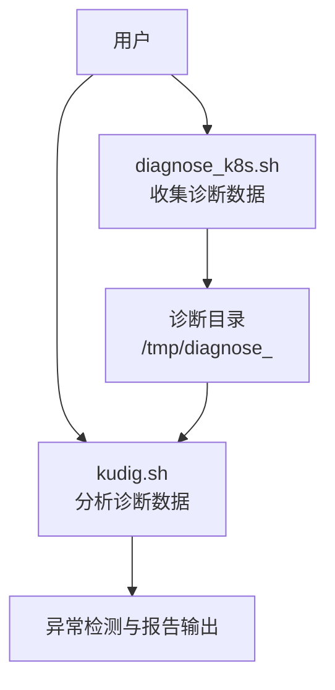
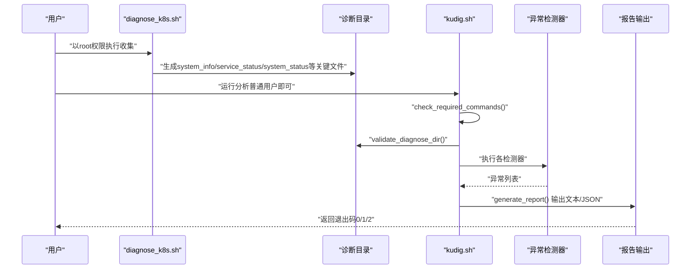
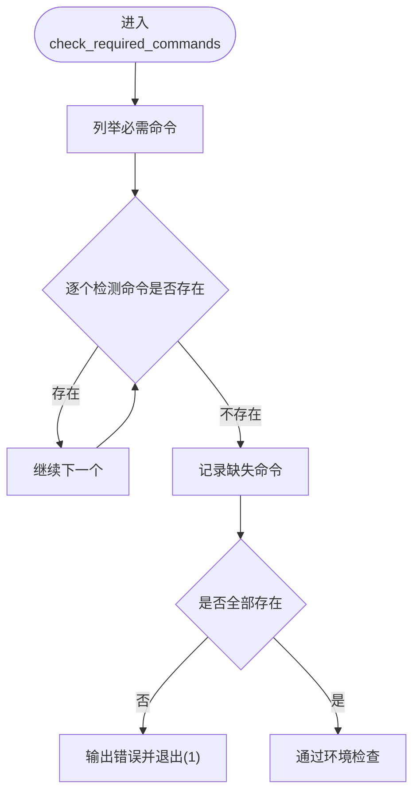
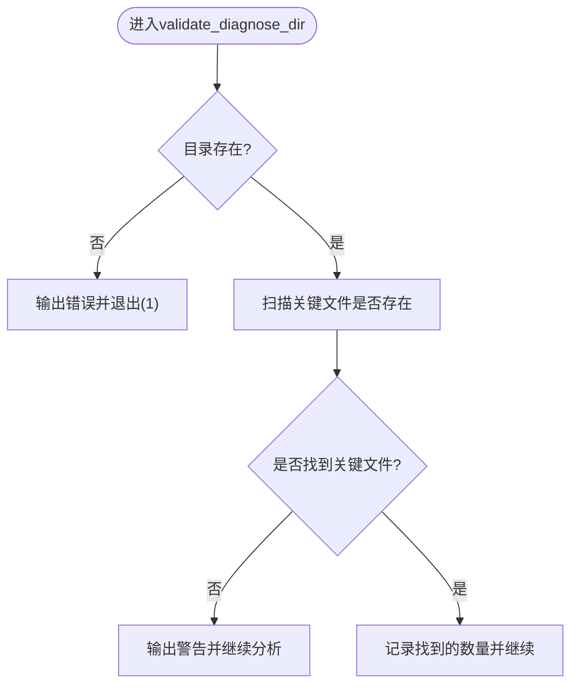
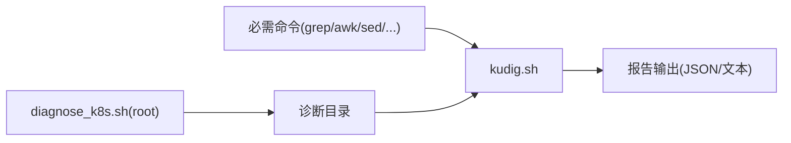

# 故障排除

<cite>
**本文引用的文件**
- [kudig.sh](file://kudig.sh)
- [diagnose_k8s.sh](file://reference/diagnose_k8s/diagnose_k8s.sh)
- [README.md](file://README.md)
- [TESTING.md](file://TESTING.md)
</cite>

## 目录
1. [简介](#简介)
2. [项目结构](#项目结构)
3. [核心组件](#核心组件)
4. [架构总览](#架构总览)
5. [详细组件分析](#详细组件分析)
6. [依赖关系分析](#依赖关系分析)
7. [性能考虑](#性能考虑)
8. [故障排除指南](#故障排除指南)
9. [结论](#结论)
10. [附录](#附录)

## 简介
本指南面向使用 kudig.sh 的用户，系统性地梳理在实际使用中可能遇到的常见问题及解决方案。内容基于 kudig.sh 源码与参考脚本的行为，结合 TESTING.md 的注意事项，帮助您快速定位并解决问题，提升诊断效率。

## 项目结构
- kudig.sh：Kubernetes 节点诊断日志分析工具，负责读取 diagnose_k8s.sh 生成的诊断目录，进行异常检测与报告输出。
- reference/diagnose_k8s/diagnose_k8s.sh：用于收集节点诊断数据的参考脚本，包含对 root 权限的要求与关键文件的生成逻辑。
- README.md：官方使用说明、输出示例、常见问题与修复建议。
- TESTING.md：测试与注意事项，强调脚本不需要 root 权限，但依赖由 root 收集的数据。

图表来源
- [diagnose_k8s.sh](file://reference/diagnose_k8s/diagnose_k8s.sh#L1-L60)
- [kudig.sh](file://kudig.sh#L1269-L1312)

章节来源
- [README.md](file://README.md#L231-L243)
- [TESTING.md](file://TESTING.md#L177-L183)

## 核心组件
- 环境检查与依赖校验：通过内置函数检测必要命令是否存在，若缺失则直接退出并提示安装。
- 诊断目录校验：判断目录是否存在，以及关键文件是否齐全；若不完整则发出警告但仍继续分析可用文件。
- 异常检测器集合：覆盖系统资源、进程服务、网络、内核、容器运行时、Kubernetes 组件、时间同步与配置等维度。
- 报告生成与退出码：根据异常级别生成文本或 JSON 报告，并依据严重异常数量返回相应退出码。

章节来源
- [kudig.sh](file://kudig.sh#L116-L139)
- [kudig.sh](file://kudig.sh#L141-L168)
- [kudig.sh](file://kudig.sh#L1269-L1312)

## 架构总览
下图展示了从数据收集到分析报告的整体流程，以及关键错误处理点。

图表来源
- [diagnose_k8s.sh](file://reference/diagnose_k8s/diagnose_k8s.sh#L1-L20)
- [kudig.sh](file://kudig.sh#L116-L168)
- [kudig.sh](file://kudig.sh#L1269-L1312)

## 详细组件分析

### 环境检查与依赖校验（check_required_commands）
- 作用：检测 bash 环境中是否具备 grep、awk、sed、wc、sort、uniq、tail、head、find 等基础命令。
- 行为：若发现缺失，记录错误并立即退出，避免后续分析因工具缺失而产生不可预期行为。
- 建议：在 CentOS/RHEL 上使用 yum，在 Ubuntu/Debian 上使用 apt-get 安装缺失的命令包。

图表来源
- [kudig.sh](file://kudig.sh#L116-L139)

章节来源
- [kudig.sh](file://kudig.sh#L116-L139)
- [README.md](file://README.md#L231-L236)

### 诊断目录校验（validate_diagnose_dir）
- 作用：确认诊断目录存在，并检查是否存在关键文件（如 system_info、service_status、system_status）。
- 行为：若关键文件全部缺失，发出警告但不中断，继续尝试分析其他可用文件；若存在部分文件，则记录找到的数量。
- 建议：确保使用完整且由 root 执行的 diagnose_k8s.sh 收集数据，避免遗漏关键文件。

图表来源
- [kudig.sh](file://kudig.sh#L141-L168)

章节来源
- [kudig.sh](file://kudig.sh#L141-L168)
- [README.md](file://README.md#L313-L338)

### 日志读取与安全处理（safe_cat/safe_line_count）
- 作用：在读取日志文件时进行安全处理，若文件不存在则返回空或零，避免因文件缺失导致脚本中断。
- 建议：当某些检测项无结果时，优先检查诊断目录中对应文件是否存在、权限是否允许读取。

章节来源
- [kudig.sh](file://kudig.sh#L183-L209)

### 异常检测器（多类检测）
- 系统资源：负载、内存、磁盘、文件句柄、PID 泄漏、inode 使用率。
- 进程与服务：kubelet、容器运行时、ps 命令挂起、D 状态进程、runc 挂起、防火墙状态。
- 网络：连接跟踪表、网卡状态、默认路由、kubelet 端口监听、iptables 规则数量。
- 内核：内核 panic、OOM Killer、只读文件系统、IO 错误、内核模块加载失败、NMI watchdog。
- 容器运行时：Docker 启动失败、存储驱动错误、Containerd 创建失败、镜像拉取失败。
- Kubernetes 组件：PLEG 不健康、CNI 插件错误、证书过期/将过期、API Server 连接失败、认证失败、Pod 驱逐、节点 NotReady、磁盘/内存压力。
- 时间同步与配置：ntpd/chronyd 服务状态、swap、IP 转发、bridge-nf-call-iptables、ulimit、SELinux。

章节来源
- [kudig.sh](file://kudig.sh#L417-L1041)

## 依赖关系分析
- 外部命令依赖：grep、awk、sed、wc、sort、uniq、tail、head、find。
- 数据来源依赖：diagnose_k8s.sh 生成的诊断目录，其中包含 system_info、service_status、system_status、network_info、memory_info、logs/* 等关键文件。
- 权限依赖：diagnose_k8s.sh 需要 root 权限以收集完整数据；kudig.sh 作为分析工具可在普通用户下运行。

图表来源
- [kudig.sh](file://kudig.sh#L116-L139)
- [diagnose_k8s.sh](file://reference/diagnose_k8s/diagnose_k8s.sh#L1-L20)
- [README.md](file://README.md#L231-L236)

章节来源
- [README.md](file://README.md#L231-L236)
- [TESTING.md](file://TESTING.md#L177-L183)

## 性能考虑
- 读取与匹配：大量使用 grep/awk/sed 等工具进行文本匹配与统计，建议确保系统资源充足，避免在极大规模日志下产生长时间阻塞。
- 并发与超时：diagnose_k8s.sh 对部分命令设置了超时，kudig.sh 则通过安全读取函数避免因单个文件异常导致整体中断。
- 输出格式：JSON 输出便于后续系统集成，但会增加 CPU 与内存开销；在资源受限环境中可优先使用文本输出。

章节来源
- [kudig.sh](file://kudig.sh#L183-L209)
- [diagnose_k8s.sh](file://reference/diagnose_k8s/diagnose_k8s.sh#L20-L35)

## 故障排除指南

### 问题1：脚本提示“命令不存在”
- 现象：运行时报错提示缺少 grep、awk、sed 等命令。
- 原因：系统缺少 bash 基础工具链。
- 解决方案：
  - CentOS/RHEL：使用 yum 安装 grep、gawk、sed、coreutils、findutils。
  - Ubuntu/Debian：使用 apt-get 安装 grep、gawk、sed、coreutils、findutils。
- 参考：README.md 中明确列出必需命令；kudig.sh 的 check_required_commands 会在缺失时直接报错并退出。

章节来源
- [README.md](file://README.md#L231-L236)
- [kudig.sh](file://kudig.sh#L116-L139)

### 问题2：诊断目录结构不完整
- 现象：输出警告“诊断目录结构可能不完整”，但脚本仍继续分析。
- 原因：diagnose_k8s.sh 未以 root 权限执行，或执行过程被中断，导致关键文件缺失。
- 解决方案：
  - 重新以 root 权限执行 diagnose_k8s.sh，确保完整收集数据。
  - 确认诊断目录包含 system_info、service_status、system_status 等关键文件。
- 参考：README.md 提示该问题的解决方案；kudig.sh 的 validate_diagnose_dir 会记录警告并继续执行。

章节来源
- [README.md](file://README.md#L313-L338)
- [kudig.sh](file://kudig.sh#L141-L168)
- [diagnose_k8s.sh](file://reference/diagnose_k8s/diagnose_k8s.sh#L1-L20)

### 问题3：无法读取某些日志文件
- 现象：部分检测项无结果或输出为空。
- 原因：诊断目录中对应文件缺失，或文件权限不足导致无法读取。
- 解决方案：
  - 检查诊断目录中是否存在目标文件（如 logs/dmesg.log、logs/kubelet.log 等）。
  - 确认文件权限允许当前用户读取；必要时以 root 权限重新收集数据。
- 参考：kudig.sh 的 safe_cat/safe_line_count 已对缺失文件进行安全处理，但若文件不存在则无法产出结果。

章节来源
- [kudig.sh](file://kudig.sh#L183-L209)

### 问题4：脚本无输出或报错
- 现象：运行后无输出或出现错误。
- 原因：缺少必要命令、诊断目录不存在或不完整、文件权限问题、或需要更详细的调试信息。
- 解决方案：
  - 使用 --verbose 选项开启详细模式，查看调试日志。
  - 确认已安装所有必需命令。
  - 确保诊断目录存在且包含关键文件。
  - 检查文件权限与存在性。
- 参考：README.md 提供 --verbose 选项说明；kudig.sh 的日志函数会根据 VERBOSE 控制输出。

章节来源
- [README.md](file://README.md#L38-L67)
- [kudig.sh](file://kudig.sh#L95-L115)
- [kudig.sh](file://kudig.sh#L217-L258)

### 问题5：退出码不符合预期
- 现象：脚本返回 0/1/2，但与预期不符。
- 原因：严重异常数量决定退出码；若有严重异常则返回 2，否则根据警告/提示返回 1 或 0。
- 解决方案：
  - 依据报告中的异常级别与数量调整排查重点。
  - 若希望快速定位，先查看严重级别异常，再逐步处理警告与提示。

章节来源
- [kudig.sh](file://kudig.sh#L1292-L1308)

## 结论
通过以上系统化的故障排除流程，您可以快速定位并解决 kudig.sh 使用中的常见问题。建议遵循“先检查依赖，再验证诊断目录完整性”的原则，并在需要时使用 --verbose 获取更多调试信息。对于仍未解决的问题，欢迎提交 GitHub Issue 并附带脚本版本、系统环境与错误日志以便进一步协助。

## 附录

### 诊断步骤建议
- 步骤1：确认 bash 环境具备 grep、awk、sed、wc、sort、uniq、tail、head、find 等命令。
- 步骤2：以 root 权限重新执行 diagnose_k8s.sh，确保生成完整诊断目录。
- 步骤3：检查诊断目录中关键文件是否存在且可读。
- 步骤4：使用 --verbose 选项运行 kudig.sh，查看详细日志。
- 步骤5：根据报告异常级别与位置，逐项排查并修复。

章节来源
- [README.md](file://README.md#L313-L338)
- [TESTING.md](file://TESTING.md#L177-L183)
- [kudig.sh](file://kudig.sh#L116-L168)