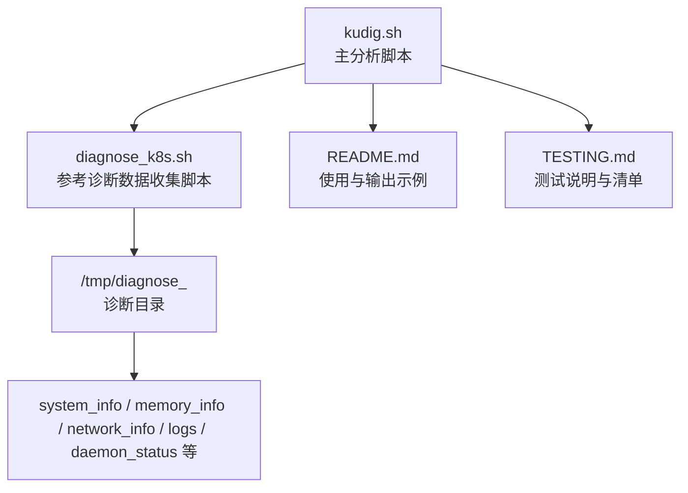
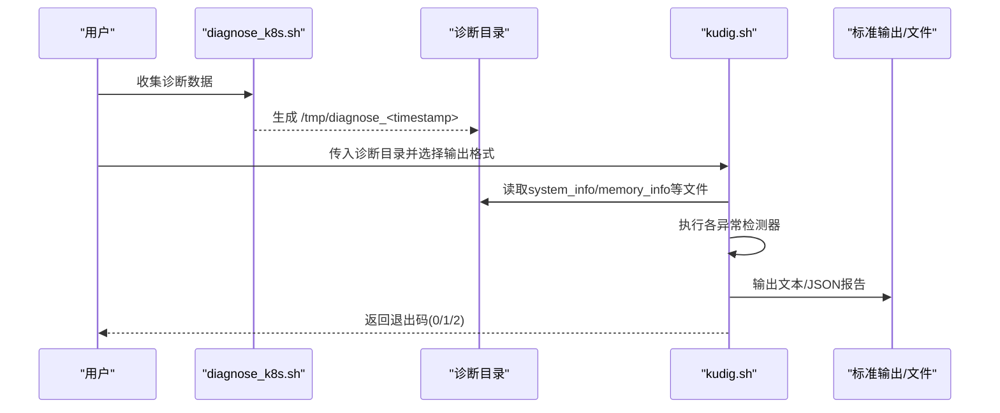
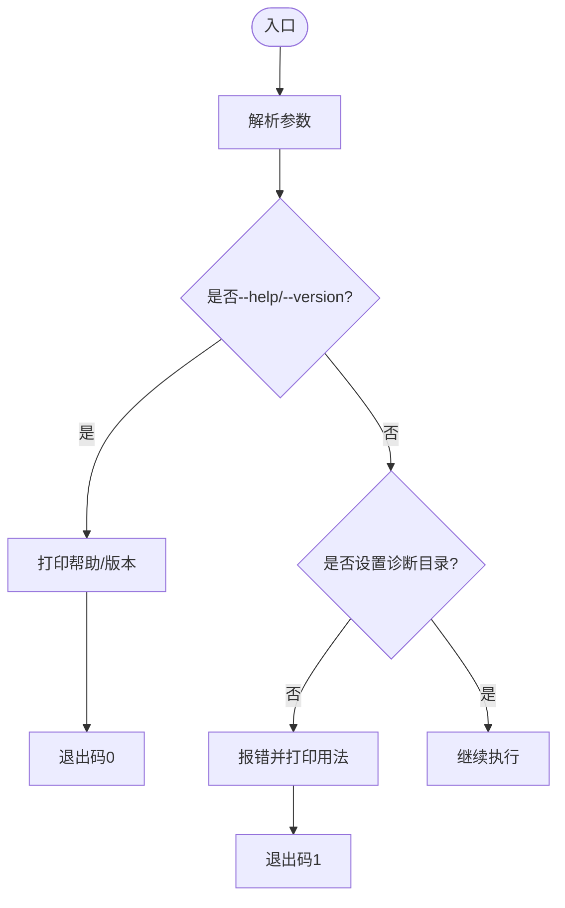
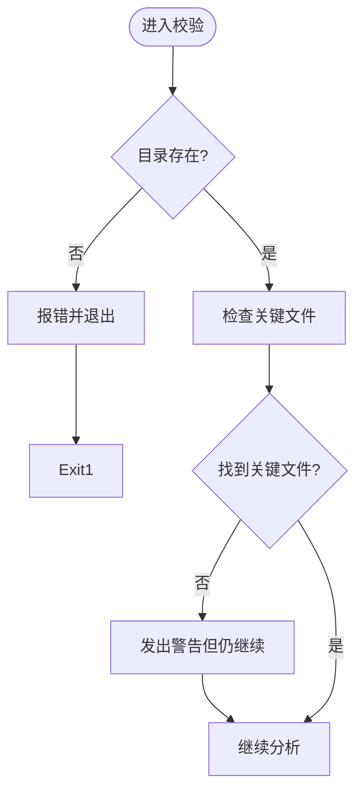
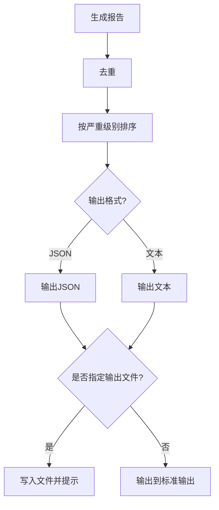
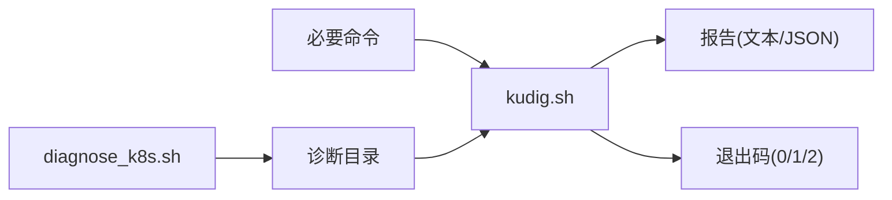
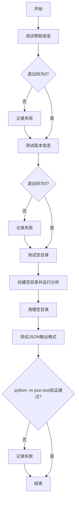

# 测试说明

<cite>
**本文引用的文件**
- [README.md](file://README.md)
- [TESTING.md](file://TESTING.md)
- [kudig.sh](file://kudig.sh)
- [reference/diagnose_k8s/diagnose_k8s.sh](file://reference/diagnose_k8s/diagnose_k8s.sh)
</cite>

## 目录
1. [简介](#简介)
2. [项目结构](#项目结构)
3. [核心组件](#核心组件)
4. [架构总览](#架构总览)
5. [详细组件分析](#详细组件分析)
6. [依赖关系分析](#依赖关系分析)
7. [性能考虑](#性能考虑)
8. [故障排查指南](#故障排查指南)
9. [结论](#结论)
10. [附录](#附录)

## 简介
本测试说明面向kudig.sh工具的功能验证与正确性评估，覆盖Linux/Unix、Windows WSL以及Git Bash三种环境下的测试方法。文档提供从诊断数据准备、基础/详细/JSON/文件输出测试，到自动化测试脚本示例与常见问题解答的全流程指导，确保在不同平台下均可稳定复现预期行为与退出码。

## 项目结构
仓库包含工具脚本、参考诊断脚本与测试说明文档，整体结构清晰，便于在不同环境中进行测试与验证。

图表来源
- [kudig.sh](file://kudig.sh#L1-L120)
- [reference/diagnose_k8s/diagnose_k8s.sh](file://reference/diagnose_k8s/diagnose_k8s.sh#L1-L120)
- [README.md](file://README.md#L230-L270)

章节来源
- [README.md](file://README.md#L1-L120)
- [TESTING.md](file://TESTING.md#L1-L68)

## 核心组件
- 命令行参数解析与帮助/版本输出
- 诊断目录校验与关键文件存在性检查
- 异常检测器集合（系统资源、进程服务、网络、内核、容器运行时、Kubernetes组件、时间同步、配置）
- 报告生成（文本/JSON）、去重与排序、输出到文件
- 退出码策略（0/1/2）

章节来源
- [kudig.sh](file://kudig.sh#L217-L258)
- [kudig.sh](file://kudig.sh#L141-L168)
- [kudig.sh](file://kudig.sh#L417-L1041)
- [kudig.sh](file://kudig.sh#L1047-L1264)
- [README.md](file://README.md#L223-L230)

## 架构总览
kudig.sh的工作流分为“数据收集”和“数据分析”两个阶段，前者由参考脚本生成诊断目录，后者由kudig.sh读取并分析，最终输出文本或JSON报告，并根据异常级别返回退出码。

图表来源
- [reference/diagnose_k8s/diagnose_k8s.sh](file://reference/diagnose_k8s/diagnose_k8s.sh#L1-L120)
- [kudig.sh](file://kudig.sh#L1269-L1312)
- [README.md](file://README.md#L237-L266)

## 详细组件分析

### 命令行与参数解析
- 支持选项：帮助、版本、详细模式、JSON输出、输出文件
- 参数：诊断目录（必填）
- 行为：校验参数合法性，打印帮助/版本，设置全局变量

图表来源
- [kudig.sh](file://kudig.sh#L217-L258)
- [kudig.sh](file://kudig.sh#L63-L87)
- [kudig.sh](file://kudig.sh#L90-L93)

章节来源
- [kudig.sh](file://kudig.sh#L217-L258)
- [kudig.sh](file://kudig.sh#L63-L93)

### 诊断目录校验
- 目录存在性检查
- 关键文件存在性宽松检查（若无关键文件则发出警告但仍继续分析）

图表来源
- [kudig.sh](file://kudig.sh#L141-L168)

章节来源
- [kudig.sh](file://kudig.sh#L141-L168)

### 异常检测器集合
- 系统资源：负载、内存、磁盘、文件句柄、线程数、inode
- 进程与服务：kubelet、容器运行时、ps挂起、D状态进程、runc挂起、firewalld
- 网络：连接跟踪表、网卡down、默认路由、端口监听、iptables规则数
- 内核：panic、OOM、只读文件系统、IO错误、内核模块加载失败、NMI watchdog
- 容器运行时：Docker启动失败/存储驱动错误、containerd创建失败、镜像拉取失败
- Kubernetes组件：PLEG不健康、CNI错误、证书过期/将过期、API Server连接失败、认证失败、Pod驱逐、节点NotReady、磁盘/内存压力
- 时间同步：ntpd/chronyd未运行
- 配置：swap未禁用、IP转发/bridge-nf-call-iptables未启用、ulimit过低、SELinux enforcing

章节来源
- [kudig.sh](file://kudig.sh#L417-L1041)

### 报告生成与输出
- 去重：基于英文标识符去重
- 排序：严重>警告>提示
- 文本输出：分级标题、异常条目、统计
- JSON输出：包含版本、时间戳、主机名、诊断目录、异常数组与汇总
- 文件输出：支持将报告写入指定文件

图表来源
- [kudig.sh](file://kudig.sh#L1047-L1264)

章节来源
- [kudig.sh](file://kudig.sh#L1047-L1264)

### 退出码策略
- 0：未检测到异常
- 1：检测到警告或提示级别异常
- 2：检测到严重级别异常

章节来源
- [README.md](file://README.md#L223-L230)
- [kudig.sh](file://kudig.sh#L1292-L1308)

## 依赖关系分析
- kudig.sh依赖于标准工具：grep、awk、sed、wc、sort、uniq、tail、head、find
- 诊断目录需由参考脚本生成，包含system_info、memory_info、network_info、logs、daemon_status等关键文件
- 退出码取决于严重级别异常的数量

图表来源
- [kudig.sh](file://kudig.sh#L122-L139)
- [reference/diagnose_k8s/diagnose_k8s.sh](file://reference/diagnose_k8s/diagnose_k8s.sh#L1-L120)
- [README.md](file://README.md#L231-L236)

章节来源
- [kudig.sh](file://kudig.sh#L122-L139)
- [reference/diagnose_k8s/diagnose_k8s.sh](file://reference/diagnose_k8s/diagnose_k8s.sh#L1-L120)
- [README.md](file://README.md#L231-L236)

## 性能考虑
- 大多数检测为文本匹配与数值计算，复杂度与文件大小线性相关
- 建议在大型诊断目录上使用JSON输出并重定向到文件，避免终端渲染开销
- 对于大量日志文件，优先保证磁盘I/O与CPU资源充足

## 故障排查指南
- 必要命令缺失：安装缺失命令后重试
- 诊断目录不完整：脚本会发出警告但仍继续分析
- 权限问题：确保诊断数据收集时具备足够权限
- 某些检测项无结果：对应日志文件缺失属正常

章节来源
- [README.md](file://README.md#L311-L337)
- [TESTING.md](file://TESTING.md#L177-L197)

## 结论
kudig.sh提供了全面的Kubernetes节点诊断能力，测试覆盖了帮助、版本、参数校验、诊断目录完整性、各类异常检测、输出格式与退出码等关键点。通过本文档提供的测试步骤与自动化脚本示例，可在Linux/Unix、WSL与Git Bash环境下稳定验证工具功能。

## 附录

### 不同环境下的测试方法

- Linux/Unix系统
  - 准备诊断数据：使用参考脚本在Kubernetes节点上收集诊断数据，生成类似/tmp/diagnose_1702468800的目录
  - 运行测试：
    - 基本测试：./kudig.sh /tmp/diagnose_1702468800
    - 详细模式：./kudig.sh --verbose /tmp/diagnose_1702468800
    - JSON格式：./kudig.sh --json /tmp/diagnose_1702468800
    - 保存到文件：./kudig.sh -o report.txt /tmp/diagnose_1702468800
  - 验证退出码：执行后使用echo "Exit code: $?"查看返回码（0/1/2）

  章节来源
  - [TESTING.md](file://TESTING.md#L7-L42)

- Windows WSL
  - 在WSL中切换到仓库目录，赋予脚本执行权限
  - 可使用参考脚本创建测试目录（模拟诊断数据），然后运行kudig.sh进行分析

  章节来源
  - [TESTING.md](file://TESTING.md#L44-L59)

- Git Bash
  - 在Git Bash中切换到仓库目录，使用bash命令执行脚本的--help选项进行验证

  章节来源
  - [TESTING.md](file://TESTING.md#L60-L68)

### 功能验证清单
- 帮助信息显示正常（--help）
- 版本信息显示正常（--version）
- 能够正确解析诊断目录
- 系统资源检测功能正常
- 进程服务检测功能正常
- 网络检测功能正常
- 内核检测功能正常
- 容器运行时检测功能正常
- Kubernetes组件检测功能正常
- 时间同步检测功能正常
- 配置检测功能正常
- 异常去重功能正常
- 异常排序功能正常
- 文本格式输出正常
- JSON格式输出正常
- 文件保存功能正常
- 退出码正确

章节来源
- [TESTING.md](file://TESTING.md#L69-L88)

### 预期输出示例
- 无异常情况：文本报告显示“未检测到异常”，退出码为0
- 有异常情况：文本报告按严重级别分组显示异常项，统计总数，退出码为2（存在严重异常）

章节来源
- [TESTING.md](file://TESTING.md#L89-L131)
- [README.md](file://README.md#L69-L138)

### 自动化测试脚本示例
以下为自动化测试脚本的完整示例，演示如何验证帮助、版本、空目录与JSON格式等功能。该脚本使用bash编写，适合在Linux/Unix、WSL或Git Bash环境中运行。

图表来源
- [TESTING.md](file://TESTING.md#L132-L175)

章节来源
- [TESTING.md](file://TESTING.md#L132-L175)

### 测试注意事项
- 脚本需要在Linux环境或支持Bash的环境下运行
- 诊断目录必须是由参考脚本生成的完整目录
- 脚本只读取诊断数据，不会修改任何文件
- 若诊断目录不完整，脚本会发出警告但仍继续分析
- 某些检测项可能因日志文件缺失而无结果，属正常现象

章节来源
- [TESTING.md](file://TESTING.md#L177-L197)
- [README.md](file://README.md#L311-L337)

### 常见问题
- 在Windows上如何测试？
  - 推荐使用WSL或Git Bash
- 如何验证JSON输出格式正确？
  - 使用python -m json.tool或jq进行格式验证

章节来源
- [TESTING.md](file://TESTING.md#L184-L197)