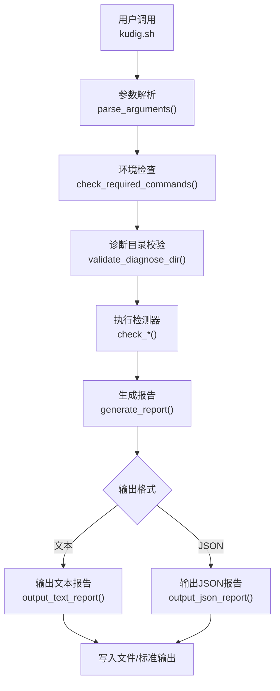
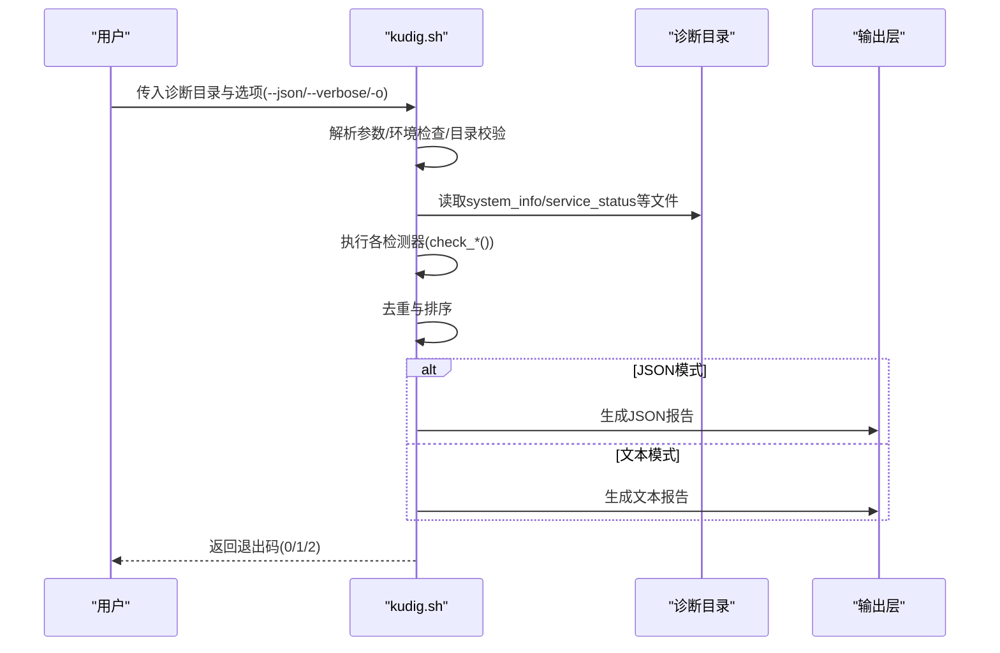
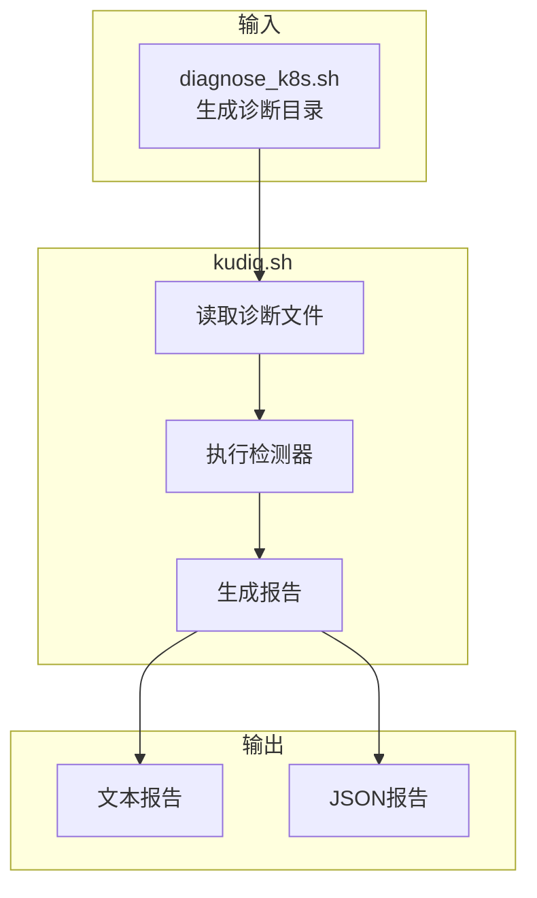

# 输出示例

<cite>
**本文引用的文件**
- [README.md](file://README.md)
- [kudig.sh](file://kudig.sh)
- [diagnose_k8s.sh](file://reference/diagnose_k8s/diagnose_k8s.sh)
- [TESTING.md](file://TESTING.md)
</cite>

## 目录
1. [简介](#简介)
2. [项目结构](#项目结构)
3. [核心组件](#核心组件)
4. [架构总览](#架构总览)
5. [详细组件分析](#详细组件分析)
6. [依赖分析](#依赖分析)
7. [性能考虑](#性能考虑)
8. [故障排查指南](#故障排查指南)
9. [结论](#结论)
10. [附录](#附录)

## 简介
本节聚焦于kudig.sh的输出示例，系统性讲解其两种报告格式：文本格式与JSON格式。我们将逐段解析报告的结构与字段，结合仓库中的示例输出，帮助读者快速理解“诊断时间”“节点信息”“分析目录”“异常列表（按严重级别分组）”“异常统计摘要”的含义与用途；并说明JSON输出如何便于程序化处理（如jq解析），以及如何通过curl集成到监控系统API。此外，还将解释终端颜色编码的作用，以及无异常与有异常两种场景下的完整输出差异。

## 项目结构
kudig.sh是一个独立的Shell脚本，负责读取由diagnose_k8s.sh生成的诊断目录，执行多类异常检测，最终输出文本或JSON格式的诊断报告。TESTING.md提供了预期输出示例，README.md展示了命令行选项与输出示例。

图表来源
- [kudig.sh](file://kudig.sh#L217-L258)
- [kudig.sh](file://kudig.sh#L1270-L1312)

章节来源
- [README.md](file://README.md#L24-L68)
- [TESTING.md](file://TESTING.md#L1-L33)

## 核心组件
- 报告生成与输出
  - 文本格式：按严重级别分组输出异常，包含标题、统计摘要与颜色编码。
  - JSON格式：结构化字段，便于程序化消费。
- 异常去重与排序
  - 基于英文标识符去重，按严重级别排序。
- 退出码策略
  - 0：无异常；1：存在警告/提示；2：存在严重异常。

章节来源
- [kudig.sh](file://kudig.sh#L1047-L1090)
- [kudig.sh](file://kudig.sh#L1091-L1180)
- [kudig.sh](file://kudig.sh#L1181-L1235)
- [kudig.sh](file://kudig.sh#L1237-L1308)
- [README.md](file://README.md#L223-L230)

## 架构总览
下图展示从诊断目录到最终报告的端到端流程，以及两种输出格式的分支。

图表来源
- [kudig.sh](file://kudig.sh#L1270-L1312)
- [kudig.sh](file://kudig.sh#L1047-L1235)
- [diagnose_k8s.sh](file://reference/diagnose_k8s/diagnose_k8s.sh#L1-L120)

## 详细组件分析

### 文本格式输出结构
- 报告头
  - 标题与时间：报告标题固定，诊断时间来自脚本运行时的时间戳。
  - 节点信息：从system_info中提取主机名。
  - 分析目录：输入的诊断目录路径。
- 异常列表（按严重级别分组）
  - 严重级别：红色标记，包含中文异常名与英文标识符，以及“详情”“位置”。
  - 警告级别：黄色标记，结构同上。
  - 提示级别：蓝色标记，结构同上。
- 异常统计摘要
  - 分别统计严重、警告、提示的数量与总计。

示例解读（基于仓库示例）
- “[严重] 系统负载过高 | HIGH_SYSTEM_LOAD”
  - 严重级别：严重
  - 中文名称：系统负载过高
  - 英文标识符：HIGH_SYSTEM_LOAD
  - 详情：给出15分钟平均负载与CPU核心数的比较
  - 位置：system_status
- “[严重] Kubelet服务未运行 | KUBELET_SERVICE_DOWN”
  - 严重级别：严重
  - 中文名称：Kubelet服务未运行
  - 英文标识符：KUBELET_SERVICE_DOWN
  - 详情：kubelet.service状态为failed
  - 位置：daemon_status/kubelet_status

章节来源
- [README.md](file://README.md#L69-L112)
- [kudig.sh](file://kudig.sh#L1091-L1180)

### JSON格式输出结构
- 字段说明
  - report_version：报告版本号（字符串）
  - timestamp：UTC时间戳（字符串，ISO 8601格式）
  - hostname：主机名（字符串）
  - diagnose_dir：诊断目录路径（字符串）
  - anomalies：异常数组，每项包含
    - severity：严重级别（字符串，中文）
    - cn_name：中文异常名（字符串）
    - en_name：英文标识符（字符串）
    - details：异常详情（字符串）
    - location：异常位置（字符串）
  - summary：统计摘要对象，包含
    - critical：严重数量（整数）
    - warning：警告数量（整数）
    - info：提示数量（整数）
    - total：异常总数（整数）

示例解读（基于仓库示例）
- anomalies数组中的元素对应文本格式中的每一项异常，字段一一映射。
- summary对象汇总各级别异常数量，便于快速统计。

章节来源
- [README.md](file://README.md#L113-L138)
- [kudig.sh](file://kudig.sh#L1181-L1235)

### 输出流程与颜色编码
- 颜色编码（仅限终端）
  - 严重：红色
  - 警告：黄色
  - 提示：蓝色
  - 未检测到异常：绿色
  - 该行为在输出文本报告时生效，JSON输出不含颜色。
- 去重与排序
  - 基于英文标识符去重，避免重复异常；随后按严重级别排序，保证输出一致性。
- 退出码
  - 0：无异常
  - 1：存在警告或提示
  - 2：存在严重异常

章节来源
- [kudig.sh](file://kudig.sh#L38-L51)
- [kudig.sh](file://kudig.sh#L1047-L1090)
- [kudig.sh](file://kudig.sh#L1292-L1308)
- [README.md](file://README.md#L223-L230)

### 程序化处理与监控系统集成
- JSON输出便于自动化脚本解析
  - 可使用jq对JSON进行过滤与统计，例如提取严重异常、统计总数等。
- 与监控系统集成
  - 可将JSON输出通过管道传递给curl，POST到监控系统的API端点，实现自动上报。

章节来源
- [README.md](file://README.md#L302-L310)
- [TESTING.md](file://TESTING.md#L133-L175)

### 无异常与有异常的完整输出示例
- 无异常示例
  - 文本格式：报告头后直接显示“未检测到异常”，并提示节点状态良好。
  - 退出码：0
- 有异常示例
  - 文本格式：按严重级别分组列出异常，包含中文名、英文标识符、详情与位置，最后统计摘要。
  - 退出码：2（存在严重异常）

章节来源
- [TESTING.md](file://TESTING.md#L89-L131)

## 依赖分析
- 输入依赖
  - 诊断目录：由diagnose_k8s.sh生成，包含system_info、service_status、system_status、network_info、memory_info、logs等文件。
- 输出依赖
  - 文本输出：依赖终端颜色支持（TTY检测）。
  - JSON输出：纯文本结构化输出，无额外依赖。
- 外部工具
  - Shell内置与常用工具（grep、awk、sed、wc、sort、uniq、tail、head、find）。

图表来源
- [diagnose_k8s.sh](file://reference/diagnose_k8s/diagnose_k8s.sh#L1-L120)
- [kudig.sh](file://kudig.sh#L1270-L1312)

章节来源
- [kudig.sh](file://kudig.sh#L117-L139)
- [diagnose_k8s.sh](file://reference/diagnose_k8s/diagnose_k8s.sh#L1-L120)

## 性能考虑
- I/O开销
  - 读取诊断目录中的多个文件，建议在本地执行，避免跨网络访问。
- 正则匹配与统计
  - 多处使用grep/awk/sed进行模式匹配与统计，建议确保诊断文件大小合理，避免超大日志导致耗时增加。
- 去重与排序
  - 基于哈希表去重与一次线性扫描统计，整体复杂度与异常数量成正比。

## 故障排查指南
- 诊断目录结构不完整
  - 现象：警告提示诊断目录结构可能不完整。
  - 处理：确保使用diagnose_k8s.sh完整收集数据，必要时以root权限执行。
- 无法读取某些日志文件
  - 现象：某些检测项无结果。
  - 处理：确认诊断数据收集时具备足够权限，检查日志文件是否存在于诊断目录中。
- 缺少必要命令
  - 现象：环境检查失败。
  - 处理：安装缺失命令（grep、awk、sed、wc、sort、uniq、tail、head、find）。

章节来源
- [README.md](file://README.md#L311-L337)
- [kudig.sh](file://kudig.sh#L117-L139)

## 结论
kudig.sh提供了清晰、一致且可程序化的诊断报告输出。文本格式适合人工快速审阅，JSON格式便于自动化脚本解析与系统集成。通过颜色编码与分组统计，用户能迅速定位问题级别与范围；结合退出码与监控系统API，可实现从诊断到告警的闭环。

## 附录

### 文本格式输出要点
- 报告头：标题、诊断时间、节点信息、分析目录
- 异常列表：按严重级别分组，每项含中文名、英文标识符、详情、位置
- 统计摘要：各级别数量与总计
- 颜色编码：严重（红）、警告（黄）、提示（蓝）、无异常（绿）

章节来源
- [README.md](file://README.md#L69-L112)
- [kudig.sh](file://kudig.sh#L1091-L1180)

### JSON格式输出要点
- 字段：report_version、timestamp、hostname、diagnose_dir、anomalies、summary
- anomalies：每项包含severity、cn_name、en_name、details、location
- summary：critical、warning、info、total

章节来源
- [README.md](file://README.md#L113-L138)
- [kudig.sh](file://kudig.sh#L1181-L1235)

### 退出码与自动化
- 0：无异常
- 1：存在警告或提示
- 2：存在严重异常
- 可结合jq与curl实现自动化上报与告警

章节来源
- [README.md](file://README.md#L223-L230)
- [README.md](file://README.md#L302-L310)
- [TESTING.md](file://TESTING.md#L133-L175)