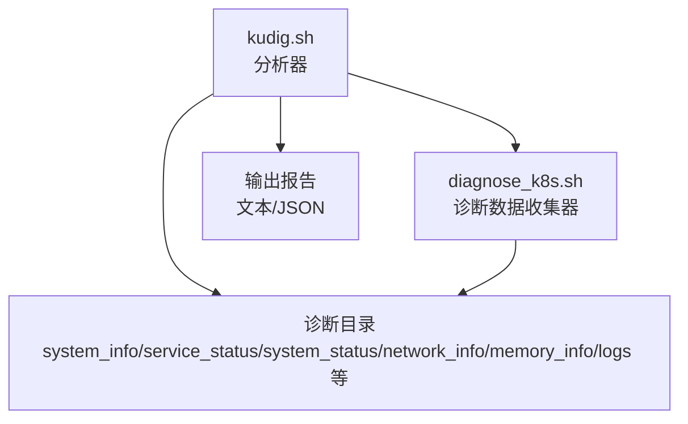
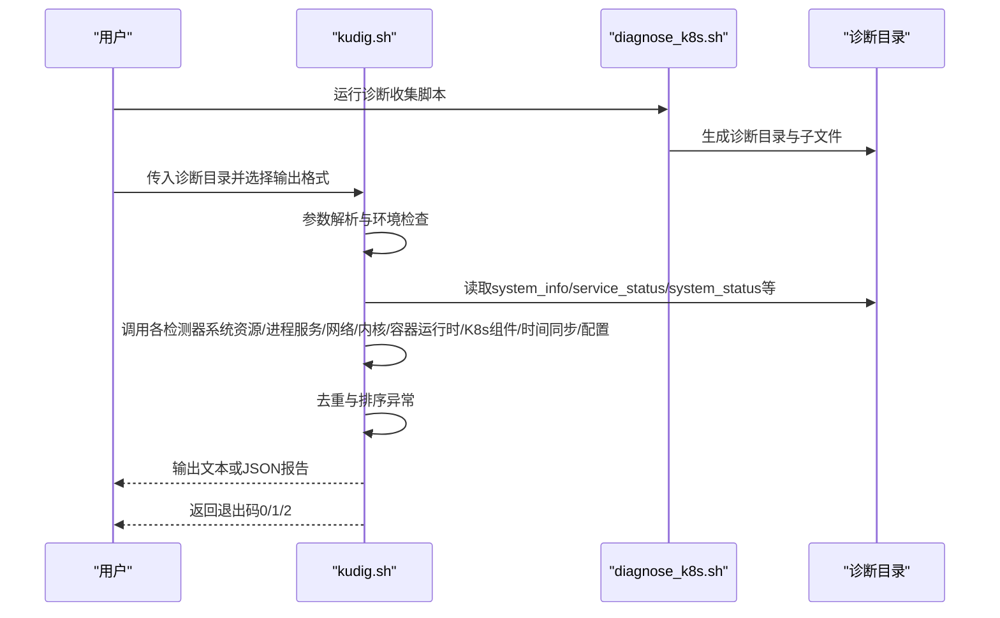
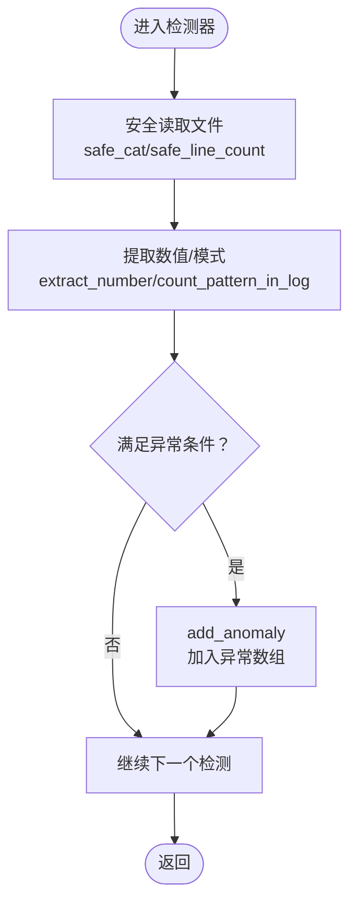
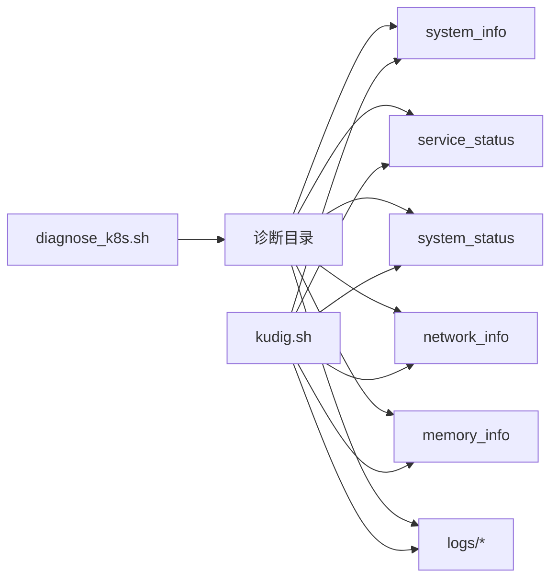

# 项目概述

<cite>
**本文引用的文件列表**
- [README.md](file://README.md)
- [kudig.sh](file://kudig.sh)
- [reference/diagnose_k8s/diagnose_k8s.sh](file://reference/diagnose_k8s/diagnose_k8s.sh)
- [reference/healthz.go](file://reference/healthz.go)
- [TESTING.md](file://TESTING.md)
</cite>

## 目录
1. [简介](#简介)
2. [项目结构](#项目结构)
3. [核心组件](#核心组件)
4. [架构总览](#架构总览)
5. [详细组件分析](#详细组件分析)
6. [依赖关系分析](#依赖关系分析)
7. [性能考量](#性能考量)
8. [故障排查指南](#故障排查指南)
9. [结论](#结论)
10. [附录](#附录)

## 简介
kudig.sh 是一个用于分析 Kubernetes 节点诊断日志的 Shell 工具，专注于从 diagnose_k8s.sh 收集的诊断数据中自动识别系统资源、进程服务、网络、内核、容器运行时、Kubernetes 组件、时间同步与配置等多维度的异常。它提供中英文对照的异常描述与英文异常标识符，支持文本与 JSON 两种输出格式，并通过严格的错误处理与模块化的函数结构实现稳健的本地化分析。

## 项目结构
仓库包含以下关键文件：
- kudig.sh：核心分析脚本，负责参数解析、环境校验、异常检测器调用、报告生成与退出码判定。
- reference/diagnose_k8s/diagnose_k8s.sh：参考的诊断数据收集脚本，生成诊断目录及各子文件，供 kudig.sh 分析。
- reference/healthz.go：参考的健康检查实现（Go），体现 Kubernetes 健康检查理念（healthz/livez/readyz），与 kudig.sh 的“异常即健康状态异常”的思路相呼应。
- README.md：功能特性、使用方法、输出示例、异常规则、退出码、工作流程与典型场景。
- TESTING.md：测试说明与自动化测试脚本模板。

图表来源
- [kudig.sh](file://kudig.sh#L1266-L1312)
- [reference/diagnose_k8s/diagnose_k8s.sh](file://reference/diagnose_k8s/diagnose_k8s.sh#L1-L506)

章节来源
- [README.md](file://README.md#L1-L120)
- [kudig.sh](file://kudig.sh#L1-L120)

## 核心组件
- 全局状态管理：通过全局数组 ANOMALIES 存储异常项，每条记录包含严重级别、中文名、英文标识、详情与位置；随后进行去重与按严重级别排序。
- 模块化检测器：按领域拆分的检测函数，分别覆盖系统资源、进程服务、网络、内核、容器运行时、Kubernetes 组件、时间同步与配置。
- 输出与格式：支持文本与 JSON 两种输出；JSON 包含报告元信息、异常列表与统计摘要。
- 严格错误处理：使用 set -euo pipefail，对缺失命令、非法参数、目录不存在等情况进行显式报错与退出。
- 安全读取与宽松检查：对不存在的文件安全读取，对诊断目录的关键文件进行宽松检查，保证在部分文件缺失时仍可继续分析。

章节来源
- [kudig.sh](file://kudig.sh#L22-L51)
- [kudig.sh](file://kudig.sh#L170-L200)
- [kudig.sh](file://kudig.sh#L1043-L1100)
- [kudig.sh](file://kudig.sh#L1237-L1312)

## 架构总览
kudig.sh 的执行流程分为：参数解析 → 环境与目录校验 → 多领域异常检测 → 报告生成 → 退出码判定。其与 diagnose_k8s.sh 的协作体现在数据格式依赖：kudig.sh 依赖诊断目录下的特定文件（如 system_info、service_status、system_status、network_info、memory_info、logs/* 等）进行解析。

图表来源
- [kudig.sh](file://kudig.sh#L1266-L1312)
- [reference/diagnose_k8s/diagnose_k8s.sh](file://reference/diagnose_k8s/diagnose_k8s.sh#L1-L506)

章节来源
- [README.md](file://README.md#L237-L266)
- [kudig.sh](file://kudig.sh#L1266-L1312)

## 详细组件分析

### 全局状态与工具函数
- 全局变量与颜色：版本号、脚本名、输出格式、详细模式、输出文件、严重级别常量与彩色输出开关。
- 异常数组：add_anomaly 以“严重级别|中文名|英文标识|详情|位置”形式追加异常。
- 安全读取：safe_cat、safe_line_count、extract_number 提供对缺失文件的安全访问。
- 文件解析辅助：get_cpu_cores、get_total_memory、get_load_average、parse_load、check_disk_usage、get_service_status、get_daemon_status、count_pattern_in_log、pattern_exists、get_conntrack_info 等，统一从诊断目录文件中抽取数值与模式。

图表来源
- [kudig.sh](file://kudig.sh#L170-L212)
- [kudig.sh](file://kudig.sh#L260-L412)

章节来源
- [kudig.sh](file://kudig.sh#L22-L51)
- [kudig.sh](file://kudig.sh#L170-L212)
- [kudig.sh](file://kudig.sh#L260-L412)

### 系统资源类检测
- 负载与内存：基于 system_status 与 memory_info，计算 CPU 核心数与 15 分钟负载阈值，以及内存使用率阈值，分别标记严重与警告。
- 磁盘空间：从 system_status 的 df 输出中筛选使用率≥90% 的挂载点，≥95% 标记严重，≥90% 标记警告。
- 文件句柄与 inode：从 system_status 中统计最大文件句柄数与 inode 使用率，超过阈值标记警告。
- 进程/线程数：通过特定段落的线程数统计，超过阈值标记严重或警告。

章节来源
- [kudig.sh](file://kudig.sh#L417-L549)

### 进程与服务类检测
- kubelet 与容器运行时：通过 daemon_status 下的 *_status 文件判断 Active 状态，若 failed/stopped 则标记严重。
- ps 命令挂起与 D 状态进程：通过 ps_command_status 文件检测挂起与不可中断睡眠状态进程。
- runc 挂起：从 system_status 中匹配 runc 挂起相关提示。
- 关键服务：service_status 中检测 firewalld 是否运行（K8s 节点建议关闭）。

章节来源
- [kudig.sh](file://kudig.sh#L551-L634)

### 网络类检测
- 连接跟踪表：从 network_info 中统计 nf_conntrack 条目与 sysctl 最大值，计算使用率，≥95% 标记严重，≥80% 标记警告。
- 网卡接口：排除回环与 veth，检测 down 状态接口。
- 路由：检查是否存在默认路由。
- 端口监听：检查 10250 端口是否处于 LISTEN。
- iptables 规则：统计规则数量，超过阈值标记警告。

章节来源
- [kudig.sh](file://kudig.sh#L636-L715)

### 内核与驱动类检测
- dmesg 与 messages：检测 Kernel panic、OOM Killer、只读文件系统、磁盘 IO 错误、内核模块加载失败、NMI watchdog 等。
- OOM 统计：对 dmesg 与 messages 中的 OOM 相关模式进行计数。

章节来源
- [kudig.sh](file://kudig.sh#L717-L797)

### 容器运行时类检测
- Docker：检查 docker.log 中启动失败与存储驱动错误。
- Containerd：统计容器创建失败次数，超过阈值标记警告。
- 镜像拉取：检查 kubelet.log 中镜像拉取失败次数，超过阈值标记警告。
- runc 挂起：复用进程服务检测逻辑，避免重复。

章节来源
- [kudig.sh](file://kudig.sh#L800-L851)

### Kubernetes 组件类检测
- PLEG 不健康：统计 kubelet.log 中 PLEG 异常次数。
- CNI 插件错误：统计 CNI 失败次数。
- 证书：检测证书过期与即将过期。
- API Server 连接失败：统计 Unable to connect to the server 次数。
- 认证失败：统计 Unauthorized 次数。
- Pod 驱逐与节点压力：检测 evicted pod、DiskPressure、MemoryPressure。

章节来源
- [kudig.sh](file://kudig.sh#L856-L957)

### 时间同步与配置类检测
- 时间同步：检测 ntpd 与 chronyd 服务状态，均未运行标记提示。
- 配置：检查 swap 是否禁用、ip_forward 与 bridge-nf-call-iptables 是否启用、ulimit open files 限制、SELinux Enforcing 状态等。

章节来源
- [kudig.sh](file://kudig.sh#L959-L1041)

### 报告生成与退出码
- 去重与排序：基于英文标识符去重，按严重级别排序。
- 文本输出：分级打印异常项与统计。
- JSON 输出：输出标准字段（报告版本、时间戳、主机名、诊断目录、异常列表、统计摘要）。
- 退出码：0（无异常）、1（有警告/提示）、2（有严重异常）。

章节来源
- [kudig.sh](file://kudig.sh#L1043-L1100)
- [kudig.sh](file://kudig.sh#L1181-L1235)
- [kudig.sh](file://kudig.sh#L1237-L1312)

## 依赖关系分析
- 数据格式依赖：kudig.sh 依赖 diagnose_k8s.sh 生成的诊断目录结构与文件命名约定，如 system_info、service_status、system_status、network_info、memory_info、logs/* 等。
- 健康检查理念关联：参考 healthz.go 展示了 Kubernetes 健康检查的注册与延迟策略（livez grace period），而 kudig.sh 将“异常即健康状态异常”的思想转化为“异常检测器 + 报告 + 退出码”的本地化实现。
- 外部命令依赖：grep、awk、sed、wc、sort、uniq、tail、head、find 等，脚本在运行前进行必要命令检查。

图表来源
- [reference/diagnose_k8s/diagnose_k8s.sh](file://reference/diagnose_k8s/diagnose_k8s.sh#L70-L110)
- [kudig.sh](file://kudig.sh#L1266-L1312)

章节来源
- [reference/diagnose_k8s/diagnose_k8s.sh](file://reference/diagnose_k8s/diagnose_k8s.sh#L1-L506)
- [kudig.sh](file://kudig.sh#L120-L168)

## 性能考量
- 命令链与管道：通过 grep/awk/sed 等命令组合进行流式处理，避免一次性读取大文件到内存，降低内存占用。
- 安全读取与短路：对不存在文件直接返回空或零，减少不必要的 I/O；对关键阈值提前判断，避免冗余统计。
- 去重与排序：使用哈希表去重，按严重级别排序，减少后续处理成本。
- 大型诊断文件：优先使用行级过滤与计数（如 count_pattern_in_log），避免将整文件载入内存；对 df/df -i 输出采用分段解析，仅处理命中行。
- 并发与超时：参考 diagnose_k8s.sh 对部分命令使用超时控制，避免阻塞；kudig.sh 通过 set -euo pipefail 保证健壮性。

章节来源
- [kudig.sh](file://kudig.sh#L120-L168)
- [kudig.sh](file://kudig.sh#L370-L394)
- [reference/diagnose_k8s/diagnose_k8s.sh](file://reference/diagnose_k8s/diagnose_k8s.sh#L20-L28)

## 故障排查指南
- 命令缺失：当 grep/awk/sed 等命令不存在时，脚本会列出缺失命令并退出。解决方法：根据系统包管理器安装缺失命令。
- 诊断目录不完整：若关键文件缺失，脚本会发出警告但仍继续分析可用文件。建议使用完整 diagnose_k8s.sh 收集数据并以 root 权限执行。
- 权限问题：若无法读取某些日志文件，检查诊断数据收集时的权限与文件存在性；确保诊断目录由 diagnose_k8s.sh 生成且包含所需文件。
- 退出码判断：结合自动化巡检脚本使用退出码进行告警（0 无异常、1 警告/提示、2 严重异常）。

章节来源
- [README.md](file://README.md#L311-L362)
- [TESTING.md](file://TESTING.md#L177-L197)
- [kudig.sh](file://kudig.sh#L120-L168)

## 结论
kudig.sh 以模块化函数与严格错误处理为核心，围绕 diagnose_k8s.sh 的诊断数据格式构建了覆盖广泛的异常检测体系。其通过 ANOMALIES 数组进行状态管理，结合去重与排序，最终输出文本或 JSON 报告，并以退出码提供自动化告警依据。与 healthz.go 所体现的健康检查理念相呼应，kudig.sh 将“异常即健康状态异常”的思想落地为可操作的本地化诊断工具。

## 附录
- 使用示例与场景：参阅 README.md 的使用方法、工作流程与典型场景（节点故障快速诊断、自动化巡检、与监控系统集成）。
- 异常规则：参阅 README.md 的异常检测规则表格，涵盖系统资源、进程服务、网络、内核、容器运行时、Kubernetes 组件、配置等类别。
- 测试说明：参阅 TESTING.md 的测试清单、预期输出示例与自动化测试脚本模板。

章节来源
- [README.md](file://README.md#L237-L362)
- [TESTING.md](file://TESTING.md#L1-L197)